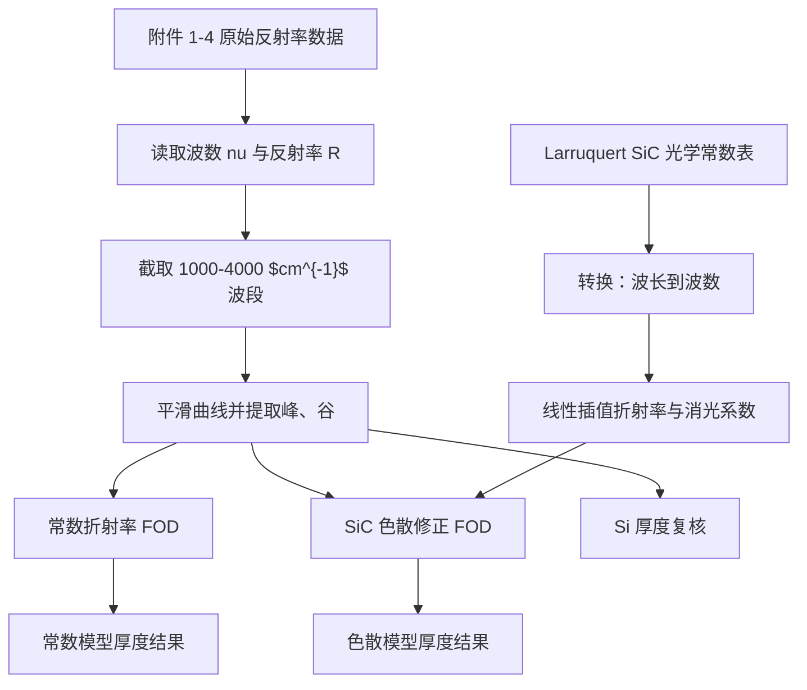

# 本轮研究过程记录：色散 FOD 与 Si 厚度复核

## 这份记录怎么看

这份文件不是最终结论，而是把本轮研究“怎么想、怎么算、怎么算出结果”写清楚。你可以按下面顺序读：

1. 先看“本轮问题”。
2. 再看“模型从常数折射率到色散折射率的变化”。
3. 最后看“结果怎么解释”和“下一步为什么要筛波段”。

如果你想直接看数学公式版模型，请先读：

- `Methods/数学模型推导-色散FOD与Si复核.md`

## 本轮问题

上一轮敏感性分析发现：常数折射率 FOD 模型对平滑窗口、极值间距阈值和波段选择比较敏感。因此不能只拿一个参数组合下的厚度值当最终答案。

本轮只解决两个具体问题：

- 对 SiC：把常数折射率 $n=2.60$ 改成 Larruquert 数据给出的 $n(\nu), k(\nu)$ 插值，观察厚度结果怎么变。
- 对 Si：用当前 FOD 极值链条复核旧论文里的 $5.13\,\mu m$ 是否能被附件 3、4 支撑。

## 数据流



## 原模型：常数折射率 FOD

FOD 是 fringe-order-difference，即“干涉级次差”方法。当前代码对峰和谷分开拟合，因为同类极值相邻时级次差为 1。

常数折射率下，代码使用的相位差近似为：

$$
\Delta p=\frac{2dn\cos\theta_1(\nu_{\mathrm{ref}}-\nu)}{10000}
$$

其中：

- $\Delta p$：相对参考极值的级次差。
- $d$：外延层厚度，单位 $\mu m$。
- $n$：常数折射率，SiC 暂用 2.60，Si 暂用 3.42。
- $\theta_1$：折射进入外延层后的角度。
- $\nu$：波数，单位 $cm^{-1}$。
- 10000：把 $cm$ 与 $\mu m$ 的单位换算接上。

这一步的问题是：真实材料的 $n$ 会随波数变化。尤其 SiC 在红外区的色散不一定能用一个常数代表。

## 新模型：色散修正 FOD

本轮把 SiC 的相位因子改成：

$$
g(\nu)=n(\nu)\cos\theta_1(\nu)\nu
$$

$$
\Delta p=\frac{2d\left[g(\nu_{\mathrm{ref}})-g(\nu)\right]}{10000}
$$

变化点只有一个：原来用 $n(\nu_{\mathrm{ref}}-\nu)$，现在用 $n(\nu)\cos\theta_1(\nu)\nu$ 的差。

这里 $\theta_1(\nu)$ 也会跟着 $n(\nu)$ 变：

$$
\cos\theta_1(\nu)=\sqrt{1-\left(\frac{\sin\theta_0}{n(\nu)}\right)^2}
$$

本轮没有把 $k(\nu)$ 直接放进 FOD 相位公式。原因是 FOD 主要描述相位差；$k$ 更直接影响吸收和极值可见性。现在先把 $k(\nu)$ 作为诊断量输出，用来判断哪些波段可能不可靠。

## Larruquert 数据怎么用

本地文件是：

```text
Sources/Literature/SiC_Larruquert_refractiveindex.yml
```

原始表按波长 $\lambda$ 给出 $n$ 和 $k$。代码先转换为波数：

$$
\nu=\frac{10000}{\lambda_{\mu m}}
$$

然后在实验波数点上做线性插值，得到每个峰/谷位置对应的 $n(\nu)$ 和 $k(\nu)$。

需要注意：Larruquert 数据对应的是室温沉积 SiC 薄膜，不一定完全等同于题目中的 4H-SiC 外延层。因此它是“可复现实验输入”，还不是最终材料真值。

## 本轮结果

SiC 色散修正后，厚度相对常数 $n=2.60$ 的 FOD 结果明显下降：

| 数据 | 极值类型 | 常数 n FOD / $\mu m$ | 色散 FOD / $\mu m$ | 变化 |
| --- | --- | ---: | ---: | ---: |
| SiC 10 度 | 峰 | 7.30 | 5.86 | -19.65% |
| SiC 10 度 | 谷 | 7.09 | 5.70 | -19.61% |
| SiC 15 度 | 峰 | 6.54 | 5.25 | -19.77% |
| SiC 15 度 | 谷 | 6.67 | 5.34 | -19.91% |

这个结果的直接含义是：如果采用 Larruquert 的 $n(\nu)$，SiC 厚度不会维持在常数 $n=2.60$ 模型下的 $6.5\sim7.3\,\mu m$，而会降到约 $5.3\sim5.9\,\mu m$。

Si 厚度复核结果：

| 数据 | 极值类型 | 当前 n=3.42 FOD / $\mu m$ | 旧论文目标 / $\mu m$ | 若要达到旧值所需等效 n |
| --- | --- | ---: | ---: | ---: |
| Si 10 度 | 峰 | 3.59 | 5.13 | 2.40 |
| Si 10 度 | 谷 | 3.41 | 5.13 | 2.28 |
| Si 15 度 | 峰 | 3.63 | 5.13 | 2.43 |
| Si 15 度 | 谷 | 3.40 | 5.13 | 2.27 |

因此，在当前 FOD 极值识别和 $n=3.42$ 的模型链条下，旧论文的 $5.13\,\mu m$ 暂时不被支撑。它不是“绝对错”，而是“目前这条可复现链条推不出来”。

## 为什么还不能收尾

本轮只是把 FOD 从常数折射率升级到色散折射率。还有三个关键风险：

- Larruquert 材料数据未必完全匹配题目样品。
- $k(\nu)$ 在低波数侧变大，吸收可能影响极值可靠性。
- FOD 只使用峰/谷位置，没有利用完整反射率曲线形状。

所以下一步不是马上写最终答案，而是筛选更合理的波段，并建立 Airy/TMM 全谱拟合模型。

## 本轮代码入口

- 统一运行入口：`Code/run_pipeline.py`
- 色散分析脚本：`Code/dispersion_analysis.py`
- 共用 FOD 和数据读取函数：`Code/spectral_pipeline.py`

## 本轮输出入口

- 中文过程说明：本文。
- 数学公式推导：`Methods/数学模型推导-色散FOD与Si复核.md`
- 色散结果摘要：`Experiments/outputs/dispersion_fod_summary.md`
- SiC 色散 FOD 表：`Experiments/outputs/dispersion_fod_results.csv`
- Larruquert 插值抽样表：`Experiments/outputs/sic_larruquert_nk_sample.csv`
- Si 厚度复核表：`Experiments/outputs/si_thickness_review.csv`
