# 第一轮资料扫描总结

## 结论

本题最强的研究路线不是继续堆复杂算法，而是把红外反射测厚做成可复现的物理反演问题。资料显示，SiC 外延层厚度常见路线包括：

1. 基于干涉极值间距的标准测厚。
2. 基于复介电函数/Drude-Lorentz 模型的反射谱全线型拟合。
3. 同时反演厚度、载流子浓度和迁移率。
4. 用转移矩阵法统一处理多光束干涉、偏振、吸收和入射角。

## 分类后的方法地图

```mermaid
flowchart TD
  A["附件反射率数据"] --> B["峰谷提取"]
  B --> C["标准峰距厚度"]
  C --> D["折射率色散修正"]
  A --> E["全谱反射率模型"]
  E --> F["Airy / TMM 多光束模型"]
  F --> G["联合反演 d, n/k 参数或载流子参数"]
  C --> H["基线结果"]
  G --> I["高级结果"]
  H --> J["模型对比与稳健性分析"]
  I --> J
  J --> K["可信厚度区间与论文结论"]
```

## 对现有论文的启发

- 现有论文提到 Lorentz-Drude 和神经网络，但应该把重点转为“复介电函数 + 全谱拟合 + 残差分析”。
- 现有论文用多项式拟合反射率验证厚度，这不够强；应改成 TMM / Airy 模型拟合反射率。
- 现有论文应加入文献中常见的“载流子浓度、迁移率、厚度联合反演”思路，至少作为改进方向。
- 题目有两个入射角，这是天然约束，应该做联合拟合，而不是只分别算平均。

## 可深挖方向

### 方向 1：标准法复现与纠错

目标：用 Python 复现标准峰距法，修正单位、峰谷选择和角度处理。

产出：

- 附件 1-4 的峰谷表。
- 每个极值间隔对应厚度分布。
- 10 deg 与 15 deg 结果一致性表。

### 方向 2：SiC 复折射率模型

目标：不要只用神经网络拟合 n,k，而要比较三种折射率方案：

- 常数折射率。
- Larruquert n,k 插值。
- Drude-Lorentz 参数模型。

产出：

- 折射率模型比较图。
- 折射率扰动对厚度的敏感性。

### 方向 3：TMM 全谱拟合

目标：用 Python 建立空气/外延层/衬底结构的反射率模型，直接拟合整条谱线。

产出：

- 反射率拟合曲线。
- 残差图。
- 厚度置信区间。
- 模型和峰距法的对比表。

### 方向 4：可靠性分析

目标：把“可靠”从一句话变成图表和统计指标。

产出：

- Bootstrap 厚度分布。
- 波段选择敏感性。
- 平滑窗口敏感性。
- n,k 扰动敏感性。
- 单角度拟合 vs 双角度联合拟合。

## 后续阅读任务

- [ ] 精读 Dong Lin et al. 2012，提取其介电函数模型和全线型拟合指标。
- [ ] 精读 Li Zhi-Yun et al. 2010，整理 SiC 红外反射测厚公式。
- [ ] 精读 Oishi et al. 2006，判断联合反演载流子参数是否适合题目。
- [ ] 下载或读取 RefractiveIndex.INFO 的 SiC Larruquert 原始 n,k 数据。
- [ ] 用 Python 实现最小 TMM 模型，先拟合 Si 数据，再拟合 SiC 数据。

