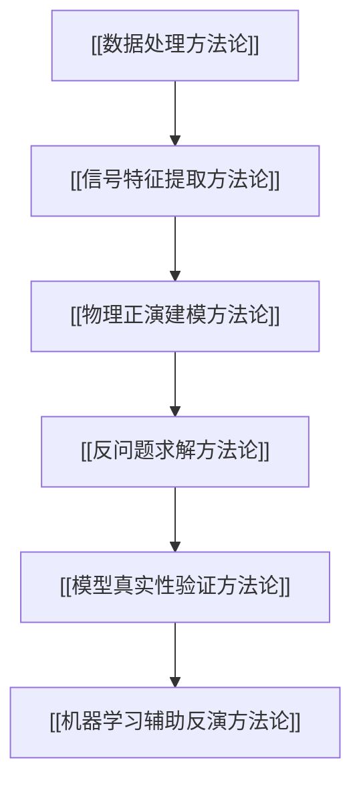

# 方法论总览

## 1. 为什么要补这个文件

之前的 `Methods/方法节点/` 更像“具体方法卡片”，例如 [[FFT频域厚度初值]]、[[TMM转移矩阵法]]、[[Lorentz-Drude介电函数模型]]。但用户指出：科研不是只堆具体模型名，而要提取根本方法论。

因此本文件回答：

$$
\text{我们到底用哪些根方法来相信或怀疑模型？}
$$

本项目的方法论应分为六层：

## 2. 六类根方法

| 方法族 | 根本问题 | 本项目当前状态 |
| --- | --- | --- |
| [[数据处理方法论]] | 数据是否干净、可比、可进入模型 | 已做读取、单位统一、波段裁剪、重采样、去趋势、仿射校准；仍需更系统的异常值和基线方法 |
| [[信号特征提取方法论]] | 反射谱中厚度信号在哪里 | 已做峰谷、FOD、FFT；待做滑窗 FFT、VMD-LSP、Lomb-Scargle |
| [[物理正演建模方法论]] | 给定厚度和材料参数，能否生成反射谱 | 已做 Airy/TMM、Dong Lorentz-Drude；待加强偏振、各向异性、粗糙界面 |
| [[反问题求解方法论]] | 如何从反射谱反推厚度和参数 | 已做网格、坐标搜索、局部细化；待做多起点、GA/CMA-ES、贝叶斯优化 |
| [[模型真实性验证方法论]] | 结果是否可信，而不只是 RMSE 小 | 已做残差、自相关、敏感性、bootstrap、双角对比；待做模型对比准则和消融实验 |
| [[机器学习辅助反演方法论]] | 能否用 ML 辅助初值、异常检测或 surrogate | 尚未用于主结果；建议用仿真谱训练 MLP/1D-CNN 或用随机森林做特征到厚度的辅助初值 |

## 3. 必须诚实区分三类方法

### 3.1 已经用于结果的方法

这些方法已经有 Python 输出，能支撑当前阶段的判断：

- [[峰谷级次差法FOD]]
- [[色散修正FOD]]
- [[FFT频域厚度初值]]
- [[Airy多光束干涉模型]]
- [[TMM转移矩阵法]]
- [[Lorentz-Drude介电函数模型]]
- [[多角度联合拟合与仿射校准]]
- [[残差诊断]]
- [[敏感性分析与稳健性分析]]
- [[坐标搜索局部细化与物理约束优化]]

### 3.2 已记录但尚未真正用于结果的方法

这些方法目前只能写“计划使用”或“待验证”，不能写进论文结果：

- [[Cauchy与Sellmeier色散模型]]
- [[VMD-LSP频域分解]]
- [[滑窗FFT与波段筛选]]
- [[牛顿迭代反演]]
- [[全局优化GA-CMAES与非唯一性]]
- [[机器学习薄膜反演]]

### 3.3 不适合直接作为主方法的方法

机器学习不能直接作为主模型，因为没有大量带真实厚度标签的样本。它适合做：

$$
\text{仿真谱训练}
\rightarrow
\text{初值预测}
\rightarrow
\text{物理 TMM 再校正}.
$$

## 4. 当前最重要的方法论矛盾

[[FFT频域厚度初值]] 发现主周期稳定：

$$
\Delta\nu\approx250\ \mathrm{cm}^{-1}.
$$

但不同折射率口径给出不同厚度：

$$
d_{\mathrm{FFT}}\approx6.5\text{--}8.0\ \mu m.
$$

而 [[TMM转移矩阵法]] + [[Lorentz-Drude介电函数模型]] 给出强候选：

$$
d\approx7.4\text{--}7.6\ \mu m.
$$

这说明当前真正要解决的不是“再调一个更小 RMSE”，而是：

$$
\text{简单周期模型、色散折射率模型、全谱 TMM 模型之间为什么不一致？}
$$

## 5. 下一步方法论路线

下一步应先补数据处理和信号提取层，而不是直接上更复杂优化：

1. 做 [[滑窗FFT与波段筛选]]，检查主周期是否随波段漂移。
2. 精读 Sun2023，判断是否需要 [[VMD-LSP频域分解]]。
3. 建立统一的 [[物理正演建模方法论]] 接口，对比常数 $n$、Larruquert、Dong、Cauchy/Sellmeier。
4. 再进入 [[反问题求解方法论]] 的全局优化和多解检查。
5. 最后考虑 [[机器学习辅助反演方法论]]，但只做辅助初值或 surrogate，不做黑箱最终结论。
