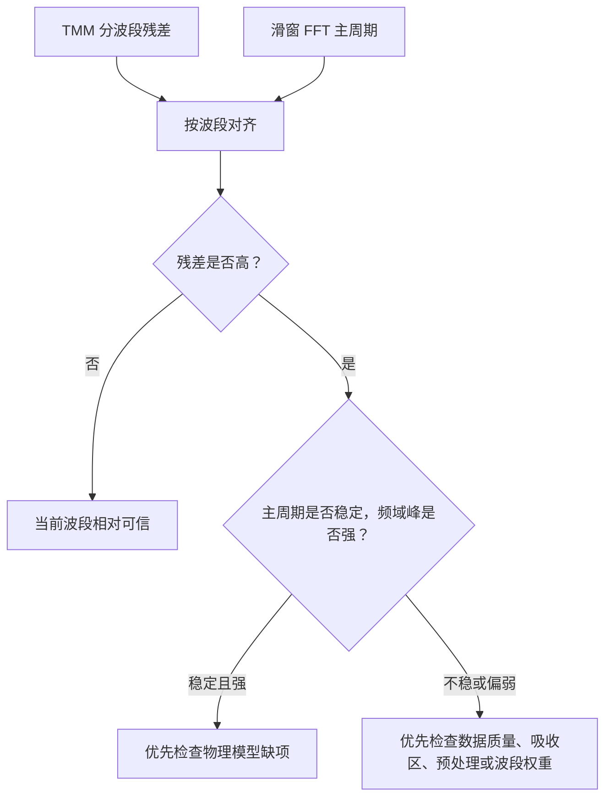

# 残差与频域证据对齐

## 方法解决什么问题

[[残差与频域证据对齐]]解决的是一个很容易被忽略的问题：

$$
\text{模型拟合不好，到底是模型错，还是这段数据本身不适合提供厚度信息？}
$$

在本项目中，[[残差诊断]]告诉我们哪些波段 TMM 拟合不好，[[滑窗FFT与波段筛选]]告诉我们哪些波段附近的条纹周期稳定。把二者对齐后，才能判断下一步是改物理模型，还是调整波段权重和数据处理。

## 核心思想

对每个残差波段 $B=[\nu_a,\nu_b]$，寻找所有与它重叠的滑窗 FFT 窗口 $W_k=[u_k,v_k]$。重叠长度为：

$$
\ell_k
=
\max\left(0,\min(\nu_b,v_k)-\max(\nu_a,u_k)\right).
$$

用 $\ell_k$ 作为权重，计算该波段附近的频域周期统计：

$$
\bar{\Delta\nu}_B
=
\frac{\sum_k \ell_k \Delta\nu_k}{\sum_k \ell_k}.
$$

同时记录周期波动范围：

$$
\mathrm{range}_B(\Delta\nu)
=
\max_k \Delta\nu_k-\min_k \Delta\nu_k.
$$

如果残差高但 $\mathrm{range}_B(\Delta\nu)$ 小，说明条纹尺度仍稳定，问题更可能来自物理模型解释。如果残差高且频域峰弱或周期不稳，说明该波段的数据证据本身也较弱。

## 本项目怎么用

新增脚本：

```text
Code/residual_fft_alignment.py
```

输入：

- `Experiments/outputs/residual_diagnostics_band_metrics.csv`
- `Experiments/outputs/sliding_fft_diagnostics_summary.csv`

输出：

- `Experiments/outputs/residual_fft_alignment_summary.csv`
- `Experiments/outputs/residual_fft_alignment_summary.md`
- `Experiments/figures/residual_fft_alignment.svg`

诊断阈值暂定为：

$$
\mathrm{range}(\Delta\nu)\le 8.0\ \mathrm{cm^{-1}},
$$

以及：

$$
\min(\mathrm{peak\_to\_median})<3.5.
$$

这两个阈值不是物理常数，只是当前阶段为了区分“周期稳定”和“频域证据偏弱”的诊断口径。

## 当前结果

本轮结果显示，高残差且周期稳定的波段数为：

$$
1.
$$

高残差且频域证据偏弱或周期不稳的波段数为：

$$
3.
$$

最重要的判断是：

$$
\text{不能把所有高残差都归因于 TMM 物理模型缺项。}
$$

对 SiC $15^\circ$ 的 $1500\text{--}2000\ \mathrm{cm^{-1}}$ 和 $2000\text{--}2500\ \mathrm{cm^{-1}}$，残差高且频域峰偏弱，下一步应优先检查局部数据质量、吸收区、预处理或波段权重。

对 SiC $10^\circ$ 的 $1500\text{--}2000\ \mathrm{cm^{-1}}$，残差高但周期相对稳定，更像是模型解释不足，后续可重点检查材料参数、背景校准、偏振或各向异性。

## 方法流程图



## 风险

- 滑窗宽度 $W=1200\ \mathrm{cm^{-1}}$，而残差波段宽度是 $500\ \mathrm{cm^{-1}}$，所以当前对齐是粗粒度诊断；
- `peak_to_median` 阈值是经验诊断阈值，不应写成严格统计检验；
- 滑窗 FFT 的 $d_{\mathrm{FFT}}$ 仍依赖 $n_{\mathrm{eff}}$，不能替代 TMM 厚度；
- 高频域证据偏弱不等于该波段无用，只说明不能单独依赖它。

## 下一步验证

下一步应建立波段权重方案。一个可解释的起点是：

$$
w_B
\propto
\frac{\mathrm{peak\_to\_median}_B}{\mathrm{RMSE}_B+\epsilon},
$$

但这个权重不能直接进入最终论文，必须先做对比实验：

1. 全波段等权 TMM；
2. 剔除频域证据偏弱波段；
3. 按频域证据加权；
4. 比较厚度低谷、双角一致性和残差结构是否改善。

