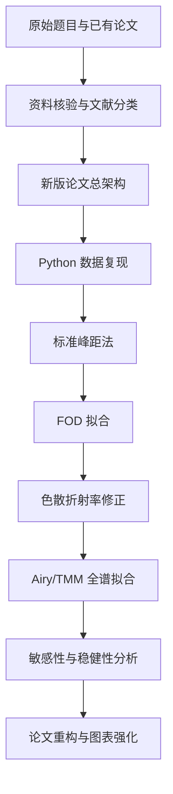

# 流程审查与风险控制

## 总体判断

当前流程方向是合理的：先用资料核验和论文总架构控制方向，再用 Python 复现实验逐步推进。它比直接重写论文更稳，因为本项目的主要风险不是“不会写”，而是“结果是否被数据和文献支撑”。

## 当前流程

## 流程优点

- 先建立文献和题目边界，降低胡编风险。
- 先搭论文架构，避免被公式细节拖散。
- 用标准峰距法作为 baseline，便于发现数值异常。
- 用 FOD 模型承接 Li2010 文献，增强论文方法来源。
- 用 TMM 处理问题三多光束干涉，比经验多项式验证更可信。
- 用两个入射角做一致性检查，充分利用题目数据结构。

## 当前最大风险

| 风险 | 表现 | 应对 |
| --- | --- | --- |
| 文献未全文精读就过度引用 | 只看 DOI/摘要就写具体结论 | 文献矩阵中保留“已全文/待核验”状态 |
| FOD 公式单位错误 | 波数 $cm^{-1}$ 与厚度 $\mu m$ 混用 | 所有公式显式保留 `10000` 单位换算 |
| 峰谷提取支配结果 | 平滑窗口一变厚度大变 | 做参数敏感性分析 |
| 外部 n,k 与题目样品不匹配 | Larruquert 数据不是同一外延层 | 把 n,k 作为不确定输入，不作为唯一真值 |
| TMM 参数过多导致多解 | 拟合很好但厚度不唯一 | 用峰距/FOD 给初值，并做双角度联合拟合 |
| 论文变成代码报告 | 细节太多，主线不清 | 正文讲模型层次，代码和参数放附录 |
| FOD 级次口径错误 | 同类极值按半级次会让厚度约偏小一半 | 峰-峰/谷-谷按一级次，峰-谷混合按半级次 |

## 是否需要调整

需要两点小调整：

1. **先复核 Si 厚度，再全面扩展 SiC。**
   目前 Si 两个角度的粗估结果约 3.5 $\mu m$，而旧论文写 5.13 $\mu m$。这个差异如果不解释，会影响整篇论文可信度。

2. **FOD 模型应作为中间主模型。**
   它有已精读文献 Li2010 支撑，复杂度适中，比直接跳到 TMM 更适合作为论文主体之一。

## 下一位 agent 接手重点

1. 运行 `Code/run_pipeline.py`。
2. 查看 `Experiments/outputs/spectral_pipeline_summary.md`。
3. 先复核 Si 厚度差异。
4. 将常数 n 的 FOD 模型替换为色散 $n(\nu)$。
5. 再进入 TMM 全谱拟合。
