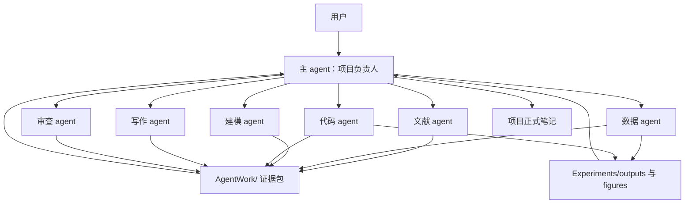

---
type: project-workflow
project: 碳化硅外延层厚度确定研究
created: 2026-05-03
---

# 多 Agent 协作分工方案

## 定位

本文是 [[碳化硅外延层厚度确定研究]] 的项目级协作程序，只对本项目生效。它继承 `AGENTS.md` 与 `System/Workflows/多Agent协作流程.md` 的安全规则，但不修改全局规则。

多 agent 协作不能消除上下文限制，也不保证总 token 更少。它真正解决的是：把复杂研究任务拆成小的、可审查的证据包，让主 agent 只保留项目方向、关键决策、模型接口和风险判断，避免在一个上下文里塞入所有论文、代码、图表和草稿。

## 核心原则

| 原则 | 说明 |
| --- | --- |
| 主 agent 负责判断 | 主 agent 负责项目路线、科学可信度、模型选择、最终论文结构和风险控制。 |
| 子 agent 负责证据包 | 子 agent 只做明确边界内的资料扫描、代码实验、初稿整理或一致性检查。 |
| 文件交接优先 | 所有协作通过项目文件、`AgentWork/`、实验输出和报告完成，不依赖口头记忆。 |
| 不把初稿当结论 | 子 agent 输出默认是候选材料，必须由主 agent 审查后才能写入论文主线。 |
| 不虚构 | 文献、数据、实验结果、参数、引用必须可追溯；未核验内容标注“待核验”。 |
| 不覆盖 | 子 agent 不修改原始资料，不覆盖既有核心笔记，不删除文件。 |

## 推荐协作结构



## 角色分工

| 角色 | 适合任务 | 禁止任务 | 输出位置 |
| --- | --- | --- | --- |
| 主 agent | 制定路线；判断结果可信性；整合文献、模型、实验和论文；更新项目交接 | 把未经核验的子 agent 输出直接写成结论 | `Status.md`、`Handoff Note.md`、正式项目笔记 |
| 文献 agent | 查找论文；核验 DOI/来源；提取公式、数据、适用条件；按方法分类 | 编造引用；未读全文却声称支持结论；下载不明来源文件 | `AgentWork/文献任务-*.md`、`Literature/` 候选记录 |
| 数据 agent | 检查附件数据结构；描述缺失值、噪声、波段、异常点；生成数据质量报告 | 修改原始 Excel/PDF；虚构数据来源 | `AgentWork/数据任务-*.md`、`Experiments/outputs/` |
| 建模 agent | 推导某一条模型路线；写清变量、假设、公式、适用范围 | 决定最终路线；跳过单位检查；忽视物理约束 | `AgentWork/建模任务-*.md` |
| 代码 agent | 在 `Code/` 中实现明确模块；运行 Python；生成可复现输出 | 分散写代码；使用非 Python 主实现；伪造运行结果 | `Code/`、`Experiments/outputs/`、`AgentWork/代码任务-*.md` |
| 写作 agent | 根据已确认材料写论文小节草稿、图表说明、摘要候选 | 添加未验证贡献；把旧论文内容当权威 | `AgentWork/写作任务-*.md`、`Writing/` 候选草稿 |
| 审查 agent | 检查单位、公式、引用、代码复现、图表和结论一致性 | 大改核心文件；替主 agent 做路线决策 | `AgentWork/审查任务-*.md` |

## 上下文节省机制

主 agent 不需要每次重新读取所有材料。日常继续项目时优先读取：

1. `AGENTS.md`
2. `System/Handoff/快速接手卡.md`
3. `System/Handoff/AI交接说明.md`
4. 本项目 `Handoff Note.md`
5. 本项目 `Status.md`
6. 本项目 `Task List.md`
7. 本项目 `Notes/项目深挖工作规则.md`
8. 当前任务直接相关的 1-3 个项目文件
9. 当前任务直接相关的 `Experiments/outputs/*.md` 或 `AgentWork/*.md`

子 agent 只接收一个任务包，不读取全项目。任务包必须包含：任务目标、允许读取文件、允许修改文件、禁止事项、输出格式、停止条件。

## 子任务标准任务包

```text
项目：碳化硅外延层厚度确定研究
角色：
任务目标：
背景摘要：
必须读取：
可选读取：
允许写入：
禁止修改：
输出格式：
必须标注：
停止条件：
完成后报告：
```

## 当前项目建议拆分

| 优先级 | 子任务 | 推荐角色 | 交付物 | 主 agent 审查重点 |
| --- | --- | --- | --- | --- |
| P0 | 已有色散 FOD 输出复核 | 代码 agent + 审查 agent | 输出核查报告、参数来源说明、可能错误清单 | $n(\nu), k(\nu)$ 适用性、单位、角度一致性 |
| P0 | 附件 3、4 硅厚度差异复核二审 | 数据 agent + 代码 agent | 数据质量报告、厚度计算输出、异常解释候选 | 旧论文 5.13 $\mu m$ 是否有可支撑链条 |
| P1 | TMM/Airy 全谱模型设计 | 建模 agent | 模型推导、输入输出、约束和评价指标 | 是否可解释、是否可复现、是否过拟合 |
| P1 | Li2010 之外核心文献核验 | 文献 agent | DOI/来源/公式/结论矩阵 | 是否真实、是否读全文、是否能支持本题 |
| P1 | 论文图表路线 | 写作 agent + 审查 agent | 图表清单、每图要证明的问题 | 图表是否服务可信度链条 |
| P2 | 学习材料拆分 | 写作 agent | 分节学习清单和练习任务 | 是否适合用户逐篇学习 |

## 主 agent 集成规则

子 agent 输出进入正式项目笔记前，主 agent 必须检查：

- 是否有可追溯来源或可复现实验输出。
- 是否区分事实、推断、假设和建议。
- 是否存在单位错误，尤其是 $cm^{-1}$、$\mu m$、角度制/弧度制。
- 是否把旧论文结果当作证据。
- 是否说明模型适用条件和误差来源。
- 是否与当前推荐路线一致：标准峰距法 -> FOD 拟合 -> 色散修正 FOD -> Airy/TMM 全谱拟合 -> 稳健性分析。

## 文件写入规则

- 子 agent 的原始输出优先写入 `AgentWork/`。
- 代码只集中写入 `Code/`，输出写入 `Experiments/outputs/` 和 `Experiments/figures/`。
- 正式研究笔记由主 agent 从 `AgentWork/` 选择、改写、整合后写入 `Notes/`、`Methods/`、`Writing/` 或 `Literature/`。
- 若正式笔记已存在，追加“AI 协作整合记录 - 2026-05-03”区域，不覆盖原文。

## 适合交给 OpenCode + DeepSeek 的低风险任务

- 文献候选清单去重和元数据表初稿。
- 已下载资料的文件索引和可读性检查。
- Markdown 表格整理。
- 论文图表清单初稿。
- 学习清单初稿。
- `AgentWork/` 中任务报告的格式整理。

这些任务不能直接决定最终模型，也不能修改全局规则、原始资料或核心结论。

## 不建议多 agent 化的任务

- 最终建模路线选择。
- 论文核心贡献判断。
- 引用真实性最后确认。
- TMM 全谱拟合结果解释。
- 与旧论文结果冲突的最终裁决。

这些任务需要主 agent 统一判断，否则容易出现多个子结论互相冲突。

## 下一步执行顺序

1. 主 agent 先检查 `Code/dispersion_analysis.py` 与已有色散输出，确认当前实验状态。
2. 派出或模拟“审查 agent”复核色散 FOD 的参数来源、单位、公式和输出表。
3. 派出或模拟“数据/代码 agent”对附件 3、4 的硅厚度差异做二审。
4. 派出或模拟“文献 agent”核验 Li2010 之外的核心文献，不够确定的全部标注“待核验”。
5. 主 agent 根据证据包决定是否进入 TMM/Airy 全谱模型实现。
