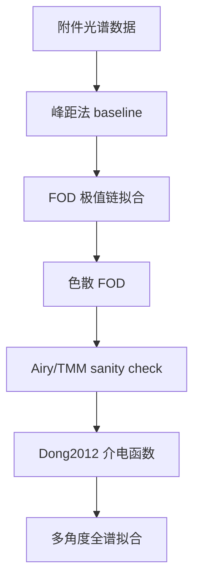
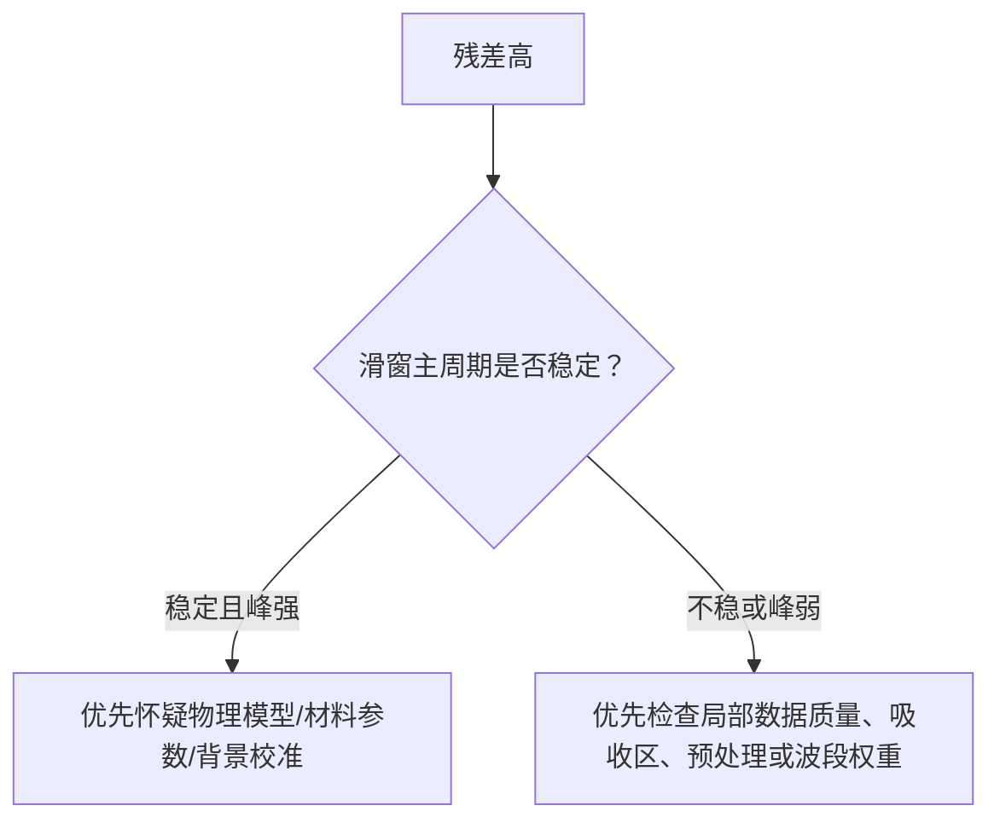

# 研究过程总览

## 0. 本文件的作用

本文件是整个项目的“研究叙事总线”。它不追求一次性写成论文，而是记录我们如何从题目、数据、公式、代码和文献一步步推进到更可信的模型。

阅读目标：

- 知道每一步为什么做；
- 知道每个模型解决了什么问题；
- 知道每个模型哪里还不可信；
- 知道代码输出和论文表达之间如何连接；
- 之后不看聊天记录，也能理解项目思想。

## AI 深挖记录 - 2026-05-04 模型主线重构入口

用户明确纠正：研究过程教程不能以图为中心，图只是辅助；核心应是“模型如何一步步完善”。因此已新增：

- [[研究过程教科书版-模型主线重构-2026-05-04]]

这份新文档应作为后续学习主入口。它按模型演进组织：相邻峰距法、常数折射率 FOD、色散 FOD、FFT 频域独立检查、Airy/TMM、Dong2012 介电函数、受约束 Dong/TMM、残差诊断、残差-FFT 对齐和波段权重稳健性。每个阶段都按“为什么需要模型、模型从哪里来、假设是什么、数学形式、Python 实现、验证图表、结论边界、为什么进入下一步”来写。

旧版 [[研究过程教科书版-2026-05-04]] 保留为图文补充和历史稿；后续继续扩写时优先扩展模型主线重构版。

## 1. 起点：不能直接相信旧论文

用户明确说明旧论文几乎是乱写的，因此本项目不能以旧论文为依据。旧论文只作为：

- 历史材料；
- 对照对象；
- 反向诊断对象。

真正依据必须来自：

- 题目 PDF；
- 附件数据；
- 可复现 Python 实验；
- 已核验文献；
- 明确标注的模型假设。

## 2. 第一阶段：数据和基础峰距模型

### 2.1 问题

题目给出的数据是反射率随波数变化的光谱。最直接的厚度信息来自干涉条纹间距。

如果折射率近似为常数，相邻同类极值间距 $\Delta\nu$ 与厚度 $d$ 的粗略关系为：

$$
d
\approx
\frac{10000}
{2n\cos\theta_1\Delta\nu}
$$

其中：

- $d$：厚度，单位 $\mu\mathrm{m}$；
- $n$：折射率；
- $\theta_1$：膜内折射角；
- $\Delta\nu$：波数间距，单位 $\mathrm{cm}^{-1}$。

### 2.2 数据处理

代码读取附件 Excel：

- 附件 1：SiC，10 度；
- 附件 2：SiC，15 度；
- 附件 3：Si，10 度；
- 附件 4：Si，15 度。

数据处理流程：

1. 读取波数和反射率；
2. 选取 $1000\text{--}4000\,\mathrm{cm}^{-1}$；
3. 对反射率做滑动平均；
4. 提取峰和谷；
5. 峰-峰、谷-谷分别计算厚度。

### 2.3 为什么不能停在这里

基础峰距法有三个问题：

1. 折射率 $n$ 被当作常数；
2. 峰谷提取依赖平滑窗口和最小峰距；
3. 它只利用极值位置，不利用整条反射率曲线。

因此它只能作为 baseline。

## 3. 第二阶段：FOD 拟合

### 3.1 模型思想

Li2010 启发了 FOD 方法：不只看相邻间距，而是用一串极值的级次差做线性拟合。

对同类极值，峰-峰或谷-谷，相邻极值相差一个完整级次。设最高波数极值为参考点，则：

$$
\Delta p_j
\approx
\frac{2d}{10000}
n\cos\theta_1
(\nu_{\mathrm{ref}}-\nu_j)
$$

将：

$$
x_j=n\cos\theta_1(\nu_{\mathrm{ref}}-\nu_j)
$$

则：

$$
\Delta p_j\approx \frac{2d}{10000}x_j
$$

厚度可由过原点线性拟合得到。

### 3.2 调试关键点

这里最容易犯错的是级次口径：

- 峰-峰/谷-谷：相邻差一级；
- 峰-谷混合：相邻差半级。

当前代码只分别拟合峰链和谷链，因此使用一级差。

### 3.3 当前结果定位

FOD 比单个峰距更稳定，但它仍然是极值模型。它仍然依赖：

- 折射率取值；
- 波段选择；
- 平滑窗口；
- 极值是否漏检。

所以 FOD 不是最终模型。

## 4. 第三阶段：色散 FOD

### 4.1 为什么引入色散

SiC 的红外折射率不是常数。若继续使用常数 $n=2.60$，厚度可能系统偏差。

色散 FOD 将相位因子从：

$$
n\cos\theta_1\nu
$$

升级为：

$$
g(\nu)=n(\nu)\cos\theta_1(\nu)\nu
$$

于是：

$$
\Delta p_j
\approx
\frac{2d}{10000}
\left[
g(\nu_{\mathrm{ref}})-g(\nu_j)
\right]
$$

### 4.2 数据来源

当前使用 Larruquert SiC `n,k` 数据：

- 来自 RefractiveIndex.INFO；
- 原始文献为 Larruquert et al. 2011；
- 该数据是 SiC 薄膜数据，不一定等同题目中的 4H-SiC 外延层。

### 4.3 当前发现

Larruquert 数据在 $1000\text{--}4000\,\mathrm{cm}^{-1}$ 中给出的 $n(\nu)$ 明显高于常数 $2.60$，所以色散 FOD 得到的 SiC 厚度比常数 FOD 下降约 20%。

这说明：折射率模型会显著改变结果。

但由于样品适配性和吸收项 $k(\nu)$ 尚未进入完整反射模型，色散 FOD 仍不能作为最终结果。

## 5. 第四阶段：Si 附件反向复核

### 5.1 为什么复核 Si

旧论文给出 Si 厚度约 $5.13\,\mu\mathrm{m}$，但当前 FOD 链条用 $n=3.42$ 得到：

$$
d_{\mathrm{Si}}\approx 3.4\text{--}3.6\,\mu\mathrm{m}
$$

### 5.2 反推思路

如果强行让同一极值链得到 $5.13\,\mu\mathrm{m}$，可以反推所需等效折射率：

$$
n_{\mathrm{required}}
\approx
2.27\text{--}2.43
$$

这个值明显低于当前 Si 常数折射率口径 $3.42$。

### 5.3 结论定位

这不能证明旧论文一定错，但说明旧论文结果暂不被当前模型链条支撑。更严谨的表达是：

> $5.13\,\mu\mathrm{m}$ 是一个待解释异常目标值，需要通过 Si 光学常数、参数敏感性和全谱模型继续裁决。

## 6. 第五阶段：Airy/TMM 最小调试模型

### 6.1 为什么进入全谱模型

FOD 只看极值位置，无法解释振幅、吸收、基底反射和多角度一致性。

Airy/TMM 模型直接计算：

$$
R(\nu;d)=|r(\nu;d)|^2
$$

单层反射振幅：

$$
r(\nu;d)
=
\frac{
r_{01}+r_{12}\exp(2i\delta)
}{
1+r_{01}r_{12}\exp(2i\delta)
}
$$

相位厚度：

$$
\delta(\nu,d)
=
\frac{2\pi}{10000}
\tilde n_1(\nu)d\cos\theta_1(\nu)\nu
$$

### 6.2 第一个 sanity check

如果外延层和衬底光学性质相同：

$$
\tilde n_1(\nu)=\tilde n_2(\nu)
$$

则外延层/衬底界面不存在反射，厚度不可识别。代码运行结果显示厚度敏感性为 `0`，这说明模型边界正确。

### 6.3 人工折射率差调试

为了测试厚度搜索流程，人为设置：

$$
\tilde n_2(\nu)=\tilde n_1(\nu)+\Delta n
$$

当 $\Delta n=0.05$ 时，误差低谷约在：

$$
d\approx 6.2\text{--}6.3\,\mu\mathrm{m}
$$

但这不是最终厚度，因为 $\Delta n$ 是人工设定。

## 7. 第六阶段：Dong2012 介电函数转化

### 7.1 为什么需要 Dong2012

上一阶段最大的问题是人工 $\Delta n$ 没有物理来源。Dong2012 提供了更合理的路径：

$$
\text{载流子浓度、迁移率、声子阻尼}
\rightarrow
\varepsilon(\nu)
\rightarrow
\tilde n(\nu)
\rightarrow
R(\nu;d)
$$

### 7.2 Dong2012 介电函数

按项目实现口径整理为：

$$
\varepsilon_{\perp}(\nu)
=
\varepsilon_{\infty,\perp}
\left[
\frac{
\nu_{L,\perp}^{2}-\nu^{2}-i\Gamma_L\nu
}{
\nu_{T,\perp}^{2}-\nu^{2}-i\Gamma_T\nu
}
-
\frac{
\nu_{p,\perp}^{2}
}{
\nu(\nu+i\gamma)
}
\right]
$$

然后：

$$
\tilde n(\nu)=\sqrt{\varepsilon(\nu)}
$$

### 7.3 本轮调试

代码 `Code/dong2012_dielectric_debug.py` 做了三件事：

1. 用 Dong2012 固定声子参数生成介电函数；
2. 用 Dong2012 表 2 的外延层/衬底参数生成两套 $\tilde n(\nu)$；
3. 用这两套 $\tilde n(\nu)$ 替代人工 $\Delta n$，对本题 SiC 数据做网格调试。

当前输出显示两个角度都在约：

$$
d\approx 7.4\,\mu\mathrm{m}
$$

附近出现误差低谷。

### 7.4 如何理解这个结果

这个结果有价值，因为它说明：

- 介电函数模型可以接入现有 Airy/TMM 代码；
- 外延层/衬底差异可以由物理参数产生，而不必靠人工 $\Delta n$；
- 两个角度的低谷位置比较接近，说明相位链条有一定一致性。

但它不能作为最终厚度，因为：

- Dong2012 表 2 参数来自其 $14.4\,\mu\mathrm{m}$ 样品；
- 本题样品的载流子浓度、迁移率和阻尼参数未知；
- 当前只用了垂直于 c 轴的介电函数分量；
- 公式由 PDF 文本抽取转化，仍需对照原文版面核对括号和符号。

## 8. 当前全项目思想

本项目不是“找一个公式算厚度”，而是在建立一条可信度逐级增强的模型链：



每一步都不是替代前一步，而是在回答前一步留下的问题：

| 阶段 | 解决的问题 | 暴露的新问题 |
| --- | --- | --- |
| 峰距法 | 快速得到厚度量级 | 常数折射率、极值不稳 |
| FOD | 用极值链增强稳定性 | 仍然只看峰位 |
| 色散 FOD | 引入 $n(\nu)$ | 样品适配与 $k(\nu)$ 未完整处理 |
| Airy/TMM | 使用整条反射率曲线 | 需要外延层/衬底光学差异 |
| Dong2012 | 用介电函数产生光学差异 | 本题样品参数未知 |
| 多角度拟合 | 用 10 度/15 度约束同一厚度 | 需要参数敏感性和稳健性 |

## 9. 下一步最有价值的研究

## 9. 第七阶段：Dong/TMM 参数敏感性

### 9.1 为什么做敏感性

Dong2012 表 2 参数不是本题样品参数。如果只用这一组参数得到 $7.4\,\mu\mathrm{m}$，那它只是“文献样品参数下的调试结果”。

为了判断模型是否有稳定信号，需要改变介电函数中的参数，观察厚度低谷是否大幅漂移。

### 9.2 当前敏感性设计

对外延层和衬底的等离子体频率分别做缩放：

$$
\nu_{p,\perp}^{\mathrm{new}}
=
s\nu_{p,\perp}^{\mathrm{Dong}}
$$

其中：

$$
s\in\{0,0.5,1.0,1.5,2.0\}
$$

对每组参数，同时考虑 10 度和 15 度数据，联合误差为：

$$
\mathrm{RMSE}_{\mathrm{joint}}
=
\frac{
\mathrm{RMSE}_{10^\circ}
+
\mathrm{RMSE}_{15^\circ}
}{2}
$$

### 9.3 当前发现

在当前敏感性范围内，联合误差较小的模型组合多集中在：

$$
d\approx 7.4\text{--}7.6\,\mu\mathrm{m}
$$

这说明在 Dong/TMM 框架下，厚度低谷有一定稳定性。

### 9.4 不能过度解释

这仍不是最终厚度。原因是：

- 目前只缩放了 $\nu_p$；
- 其他参数还没有系统敏感性；
- 本题样品的载流子浓度和迁移率未知；
- 还没有做最终多角度联合优化。

但它已经给出一个重要研究判断：

> 当前最有希望的厚度候选区间正在从 FOD 的分散结果，逐步收束到 Dong/TMM 全谱模型下的 $7.4\text{--}7.6\,\mu\mathrm{m}$ 附近；该区间需要继续用更严格参数拟合和稳健性分析确认。

## 10. 下一步最有价值的研究

## 10. 第八阶段：模型路线对比

### 10.1 为什么做路线对比

随着模型越来越多，单个数值已经无法说明问题。需要把所有模型放在一起，比较它们的假设、输入、输出和可信度。

新增脚本：

```text
Code/model_route_comparison.py
```

该脚本从已有 CSV 输出中自动生成：

- `Experiments/outputs/model_route_comparison.csv`
- `Experiments/outputs/model_route_comparison_summary.md`

并提升为方法笔记：

```text
Methods/模型路线结果对比与可信度.md
```

### 10.2 当前汇总判断

目前最值得关注的不是单个厚度值，而是模型链条逐渐收束：

$$
\text{常数 FOD: }6.6\text{--}7.2
\quad
\rightarrow
\quad
\text{色散 FOD: }5.3\text{--}5.8
\quad
\rightarrow
\quad
\text{Dong/TMM: }7.4\text{--}7.6
$$

这些结果看起来不完全一致，但它们揭示了不同假设的影响：

- FOD 主要由极值位置决定；
- 色散 FOD 主要暴露 $n(\nu)$ 的影响；
- Dong/TMM 同时使用全谱线型和介电函数差异。

### 10.3 $\gamma$ 敏感性补充

新增脚本：

```text
Code/dong2012_tmm_gamma_sensitivity.py
```

它缩放 Drude 阻尼 $\gamma$：

$$
\gamma^{\mathrm{new}}=s\gamma^{\mathrm{Dong}}
$$

当前结果显示，所有 $\gamma$ 缩放组合的低谷只落在：

$$
d\approx 7.44\text{--}7.46\,\mu\mathrm{m}
$$

这说明当前厚度低谷对 $\gamma$ 扰动较稳定。

## 11. 下一步最有价值的研究

下一步应该扩展“模型路线对比表”背后的敏感性：

1. 不固定 Dong2012 表 2 的全部参数；
2. 以 $\nu_p$ 或等效折射率差作为敏感性参数；
3. 对每组参数同时拟合 10 度和 15 度；
4. 观察厚度 $d$ 是否稳定；
5. 若厚度随参数大幅漂移，则论文必须强调不确定性。

并进一步扩展敏感性：

- 改变 $\gamma$；
- 改变 $\Gamma_L,\Gamma_T$；
- 改变波段；
- 比较是否加入 $400\text{--}1000\,\mathrm{cm}^{-1}$ Reststrahlen 区；
- 最后形成论文中的“模型可信度增强链条”。

## 12. $\Gamma_L,\Gamma_T$ 声子阻尼敏感性

### 12.1 为什么这一轮重要

Dong2012 介电函数不只有自由载流子项，还有晶格振动项。上一轮已经检查了 $\nu_p$ 和 $\gamma$，但如果不检查 $\Gamma_L,\Gamma_T$，模型可信度链条仍然缺一块。

声子阻尼控制的是谱线线宽，尤其会影响吸收带附近的反射谱形状。因此本轮要回答：

> 当前 $7.4\text{--}7.6\ \mu m$ 的厚度低谷，是否会随着 $\Gamma_L,\Gamma_T$ 改变而明显漂移？

### 12.2 本轮做法

新增并运行：

```text
Code/dong2012_tmm_phonon_sensitivity.py
```

输出：

- `Experiments/outputs/dong2012_tmm_phonon_sensitivity_summary.md`
- `Experiments/outputs/dong2012_tmm_phonon_sensitivity_joint.csv`
- `Experiments/outputs/dong2012_tmm_phonon_sensitivity_by_angle.csv`

本轮固定 $\nu_p$ 和 $\gamma$，只缩放 $\Gamma_L,\Gamma_T$：

$$
\Gamma_L^{\mathrm{new}}=s_L\Gamma_L^{\mathrm{Dong}},
\quad
\Gamma_T^{\mathrm{new}}=s_T\Gamma_T^{\mathrm{Dong}}
$$

其中：

$$
s_L,s_T\in\{0.5,1.0,1.5,2.0\}
$$

### 12.3 当前发现

两类敏感性设计得到的低谷范围为：

$$
\text{layer\_shared\_scale:}\quad d\in[7.42,7.48]\ \mu m
$$

$$
\text{lt\_shared\_scale:}\quad d\in[7.40,7.48]\ \mu m
$$

这说明在当前实验设置下，$\Gamma_L,\Gamma_T$ 扰动没有把厚度低谷推离 $7.4\text{--}7.6\ \mu m$ 区间。

### 12.4 这给论文带来的价值

这一轮可以作为论文“稳健性分析”的一部分。它的表述逻辑是：

1. 先说明 Dong/TMM 低谷不是只在 Dong2012 表 2 原参数下出现。
2. 再说明改变 $\nu_p$、$\gamma$、$\Gamma_L,\Gamma_T$ 后低谷仍集中。
3. 最后强调仍需波段敏感性和联合优化，所以当前只能称为候选区间。

当前更稳妥的模型路线判断是：

$$
d_{\mathrm{candidate}}\approx 7.4\text{--}7.6\ \mu m
$$

这个区间已经比早期 FOD 单点结果更可信，但还没有达到“最终厚度”的证据标准。

## 13. 波段敏感性：低波数强吸收区是否会改变厚度

### 13.1 为什么要检查波段

前面的参数敏感性检查的是模型参数，但数据本身也有选择问题。附件覆盖约 $400\text{--}4000\ cm^{-1}$，而 Dong2012 的 SiC 声子频率大约在：

$$
797.3\text{--}970.1\ cm^{-1}
$$

这一段对应强晶格振动区。它可能让反射谱误差变大，也可能干扰厚度低谷。因此，不能默认“用越宽波段越好”。本轮要检查不同波段是否给出相近厚度。

### 13.2 本轮做法

新增并运行：

```text
Code/dong2012_tmm_band_sensitivity.py
```

它固定 Dong2012 表 2 参数，只改变波段：

$$
400\text{--}4000,\ 
800\text{--}4000,\ 
1000\text{--}4000,\ 
1200\text{--}4000,\ 
1500\text{--}4000,\ 
1800\text{--}4000,\ 
2000\text{--}4000,\ 
1500\text{--}3500
$$

单位为 $cm^{-1}$。

### 13.3 当前发现

全部波段的联合低谷范围：

$$
d\in[7.38,7.44]\ \mu m
$$

不含 Reststrahlen 区的高波数波段联合低谷范围：

$$
d\in[7.42,7.44]\ \mu m
$$

包含低波数强吸收区时，联合 RMSE 明显变大；但低谷仍在 $7.4\ \mu m$ 附近。这说明低波数区会影响拟合质量，却没有推翻当前厚度候选区间。

### 13.4 对论文的意义

论文里可以把波段敏感性写成一个很强的可信度论证：

1. 高波数干涉区给出的厚度非常稳定；
2. 包含低波数强吸收区后误差变大，因此该区不应作为主要拟合证据；
3. 但即使纳入低波数区，厚度低谷也没有大幅偏离，说明当前候选区间有一定稳健性。

这一步会让论文从“我算出一个厚度”变成“我解释了为什么这个厚度可信，以及哪些数据不适合作为强证据”。

## 14. 分阶段坐标搜索：联合参数会不会推翻候选区间

### 14.1 为什么要做坐标搜索

单参数敏感性已经说明很多局部问题，但真正的材料参数不会只单独变化。为了检查联合参数变化是否会推翻当前结论，本轮做了分阶段坐标搜索。

它不是最终全局优化，而是一个学习友好的中间步骤：

$$
\text{baseline}
\rightarrow
\nu_p
\rightarrow
\gamma
\rightarrow
\Gamma_L,\Gamma_T
$$

每一步只改变一类参数，观察联合 RMSE 和厚度低谷如何变化。

### 14.2 当前结果

最终选出的参数路径为：

$$
s_{\nu_p,\mathrm{epi}}=1.5,\quad
s_{\nu_p,\mathrm{sub}}=1.0
$$

$$
s_{\gamma,\mathrm{epi}}=2.0,\quad
s_{\gamma,\mathrm{sub}}=0.5
$$

$$
s_{\Gamma,\mathrm{epi}}=2.0,\quad
s_{\Gamma,\mathrm{sub}}=1.5
$$

最终联合低谷为：

$$
d=7.46\ \mu m
$$

相对 baseline 的联合平均 RMSE 改善约：

$$
2.4\%
$$

### 14.3 如何解释

这个结果没有推翻当前候选区间，反而说明联合参数调整后，低谷仍停在 $7.4\text{--}7.6\ \mu m$ 内。

但它也没有强到可以作为最终参数拟合，因为：

- 搜索网格很粗；
- 搜索顺序会影响结果；
- 没有参数置信区间；
- 没有连续优化；
- 反射率线性标定模型仍然是简化假设。

因此，这一步最适合作为论文中的“探索性联合参数稳健性分析”，而不是最终优化结果。

## 15. 局部不确定性：厚度低谷有多尖

### 15.1 为什么要做不确定性分析

有了候选厚度之后，下一步不是急着宣布结果，而是要问：

> 如果数据有小扰动，$d$ 会不会从 $7.45\ \mu m$ 跳到别的区域？

这关系到论文能不能说“结果稳定”。

### 15.2 本轮做法

新增并运行：

```text
Code/dong2012_tmm_uncertainty.py
```

它固定分阶段坐标搜索得到的材料参数，在 $1500\text{--}4000\ cm^{-1}$ 高波数区做两件事：

1. 扫描细厚度网格，得到 $\mathrm{RMSE}_{\mathrm{joint}}(d)$ 剖面；
2. 对拟合残差做 moving block bootstrap，再重新搜索厚度。

### 15.3 当前发现

厚度剖面最小值：

$$
d=7.455\ \mu m
$$

$5\%$ RMSE 支持区间：

$$
[7.435,7.475]\ \mu m
$$

残差块 bootstrap 的 $2.5\%$ 到 $97.5\%$ 分位范围：

$$
[7.4449,7.4651]\ \mu m
$$

### 15.4 如何解释

这说明在固定材料参数的模型口径下，厚度低谷非常集中，数据残差扰动不会把结果推出 $7.4\text{--}7.6\ \mu m$。

但它仍然不能等同于最终置信区间，因为材料参数本身也有不确定性。更准确的说法是：

> 当前数据扰动不确定性较小，主要未决不确定性来自材料参数、误差模型和是否采用更严格的连续优化。

## 16. 从论文初稿回到可见证据：图表与最佳拟合曲线

论文初稿建立后，本项目进入一个新的审查点：不能只让读者相信文字，还要让读者看见证据。为此新增两个脚本：

```text
Code/paper_assets.py
Code/dong2012_tmm_bestfit_export.py
```

前者把已有实验输出整理为论文图表和参数表；后者在固定代表厚度

$$
d=7.455\ \mu m
$$

下导出 Dong/TMM 的实验谱线、拟合谱线和残差。

当前最重要的新发现是：$10^\circ$ 与 $15^\circ$ 的固定参数拟合难度不同。

$$
\mathrm{RMSE}_{10^\circ}\approx0.00133086
$$

$$
\mathrm{RMSE}_{15^\circ}\approx0.00214457
$$

这说明 $15^\circ$ 数据对当前固定材料参数更苛刻。这个现象不推翻 $7.4\text{--}7.6\ \mu m$ 候选区间，但提醒我们后续不能只报告联合 RMSE，还要检查分角度残差结构。

本阶段形成的论文资产包括模型路线横向对比图、RMSE-厚度剖面图、bootstrap 厚度分布图、波段敏感性图、固定参数最佳拟合谱线图和残差图。下一步最值得做的是参数敏感性热力图与连续联合优化。

## 17. 局部细化后，候选区间是否改变

随后补充了参数敏感性热力图，并新增无 `scipy` 条件下的局部细化坐标搜索：

```text
Code/dong2012_tmm_local_refinement.py
```

它不是连续全局优化，而是在粗网格最终状态附近，用 $0.125$ 步长做两轮局部坐标检查。

细化前：

$$
d^\ast=7.455\ \mu m,
\qquad
\mathrm{RMSE}_{\mathrm{joint}}=0.00173772
$$

细化后：

$$
d^\ast=7.465\ \mu m,
\qquad
\mathrm{RMSE}_{\mathrm{joint}}=0.00171152
$$

联合 RMSE 相对改善约：

$$
1.508\%
$$

这给当前结论增加了一个证据：局部小步长参数调整没有把厚度推离 $7.4\text{--}7.6\ \mu m$。但它也暴露了一个更重要的问题：部分参数触及局部边界，说明后续不能只让数值优化自由追 RMSE，而要给材料参数设置物理合理范围。

## 18. RMSE 热力图补上了什么

随后补充了三张 RMSE 参数敏感性热力图：

- `paper_fig10_rmse_heatmap_nu_p_sensitivity.svg`
- `paper_fig11_rmse_heatmap_gamma_sensitivity.svg`
- `paper_fig12_rmse_heatmap_phonon_sensitivity.svg`

这一步的意义是区分：

$$
\text{厚度低谷稳定}
\neq
\text{拟合质量同样稳定}
$$

当前解读是：$\nu_p$ 最关键。它的扫描范围内厚度低谷可扩展到约 $7.38\text{--}7.66\ \mu m$，联合 RMSE 也从约 $0.00178$ 变化到 $0.00639$。相比之下，$\gamma$ 扫描下厚度低谷只在 $7.44\text{--}7.46\ \mu m$ 内移动，联合 RMSE 变化也较小。

因此，下一步真正值得做的不是盲目扩大所有参数搜索范围，而是优先为 $\nu_p$ 建立物理合理边界。

## 19. 研究方向自检

用户提醒：研究推进一段时间后必须主动检查方向，防止偏离核心目标。根据 `Notes/项目深挖工作规则.md` 的新增规则，本阶段自检如下。

当前研究主线是：

$$
\text{构建一个更精确、更可解释的 SiC 外延层厚度反演模型}
$$

并用题目数据、Python 可复现实验、残差分析、敏感性分析、稳健性分析和可视化图表不断审查该模型。

目前没有偏离主线。已完成的图表和脚本不是为了堆数量，而是在回答这些问题：

- FOD、色散 FOD、Dong/TMM 各自给出的厚度为什么不同？
- Dong/TMM 的厚度低谷是否在双角度下稳定？
- 参数扰动会不会推翻 $7.4\text{--}7.6\ \mu m$ 候选区间？
- 拟合质量好的参数区域和厚度稳定区域是否一致？
- 哪个材料参数最需要物理边界？

当前最有价值的下一步是：

$$
\text{为 }\nu_p\text{ 或载流子浓度建立物理合理边界}
$$

然后再做受约束优化。暂时不应继续盲目扩大参数搜索，也不应继续增加无解释的图表。

## 20. $\nu_p$ 不再只是调参旋钮：它对应载流子浓度

按照上一节的方向自检，本轮没有继续堆图，而是回到最敏感参数 $\nu_p$ 的物理含义。Dong2012 Eq. (2) 给出：

$$
\nu_{p,\perp}
=
\frac{1}{2\pi c}
\sqrt{
\frac{Nq^2}
{m_{\perp}^{*}\varepsilon_0\varepsilon_{\infty,\perp}}
}.
$$

因此：

$$
N(s_{\nu_p})=s_{\nu_p}^{2}N_0.
$$

这解释了为什么 $\nu_p$ 不能无约束扩展：如果 $s_{\nu_p}=2$，载流子浓度不是变为 $2$ 倍，而是变为 $4$ 倍。

新增脚本：

```text
Code/dong2012_plasma_boundary.py
```

生成：

```text
Experiments/outputs/dong2012_plasma_boundary_table.csv
Experiments/outputs/dong2012_plasma_boundary_summary.md
experiments/dong2012_plasma_boundary_summary.md
```

当前换算得到：

$$
N_{\mathrm{epi},0}\approx1.636\times10^{17}\ \mathrm{cm}^{-3},
\qquad
N_{\mathrm{sub},0}\approx4.356\times10^{18}\ \mathrm{cm}^{-3}.
$$

局部细化最终状态中的外延层 $s_{\nu_p}=1.75$ 等价于：

$$
N_{\mathrm{epi}}\approx5.010\times10^{17}\ \mathrm{cm}^{-3}.
$$

这不是本题样品真实掺杂结论，只是把当前数值最优状态翻译成物理量后得到的候选参数状态。

下一轮建议采用候选边界：

$$
s_{\nu_p,\mathrm{epi}}\in[0.75,1.75],
\qquad
s_{\nu_p,\mathrm{sub}}\in[0.75,1.25].
$$

对应：

$$
N_{\mathrm{epi}}\in[9.20\times10^{16},5.01\times10^{17}]\ \mathrm{cm}^{-3},
$$

$$
N_{\mathrm{sub}}\in[2.45\times10^{18},6.81\times10^{18}]\ \mathrm{cm}^{-3}.
$$

这一步把后续问题从“能否继续降低 RMSE”改成了更科学的问题：

> 在物理合理的载流子浓度范围内，$d\approx7.4\text{--}7.6\ \mu m$ 是否仍然稳定？

## 21. 把 $\nu_p$ 物理边界真正接入局部优化

随后新增：

```text
Code/dong2012_tmm_constrained_refinement.py
```

这一步不是换一个新模型，而是在上一轮局部细化的基础上，给 $\nu_p$ 加上候选物理边界：

$$
s_{\nu_p,\mathrm{epi}}\in[0.75,1.75],
\qquad
s_{\nu_p,\mathrm{sub}}\in[0.75,1.25].
$$

运行结果为：

$$
d^\ast=7.465\ \mu m,
\qquad
\mathrm{RMSE}_{\mathrm{joint}}=0.00171152.
$$

这个结果和无专门 $\nu_p$ 物理边界的局部细化一致。因此，当前候选厚度区间没有被物理边界推翻。

但更重要的是边界状态：

$$
s_{\nu_p,\mathrm{epi}}=1.75
$$

触及上界。这说明当前数据倾向于把外延层 Drude 项推到候选边界的高端。科学表达上，这不能叫“内部最优材料参数”，只能叫“候选物理边界内的边界最优状态”。

分角度单独最优结果为：

| 数据 | $d^\ast$ | RMSE |
| --- | --- | --- |
| SiC $10^\circ$ | $7.490\ \mu m$ | $0.00112873$ |
| SiC $15^\circ$ | $7.430\ \mu m$ | $0.00188375$ |

这提示论文中还应继续检查两个角度的残差差异，而不是只写联合 RMSE。

当前最谨慎的综合判断仍然是：

$$
d\approx7.4\text{--}7.6\ \mu m.
$$

局部代表值可以写成：

$$
d^\ast\approx7.465\ \mu m,
$$

但必须附带条件：这是在 Dong2012 介电函数迁移、候选 $\nu_p$ 物理边界和当前局部细化口径下得到的代表值，不是无条件最终厚度。

## 22. 从旧模型走向近年资料约束

用户指出当前路线不能只停留在十年前的 Dong2012。这一条提醒改变了后续研究的证据结构。

新的判断不是否定 Dong2012，而是把它放回合适位置：

$$
\text{Dong2012}=\text{4H-SiC 红外介电函数和 TMM 物理地基},
$$

但最终模型必须再接受近年资料和本题数据的共同审查：

$$
\text{可信厚度}
\Longleftrightarrow
\text{频域主周期}
+
\text{双角联合拟合}
+
\text{残差结构}
+
\text{材料参数边界}
+
\text{全局优化稳定性}
\text{共同支持}.
$$

本轮用多 agent 分别核验了三类资料：

- 官方 2025 B 题展示论文与讲评：用于学习优秀论文如何做数据预处理、波段筛选、双角联合拟合、多光束讨论和图表表达。
- 近年算法与材料论文：Sun et al. 2023 用于 FTIR epi-wafer 频域基线，Dutta et al. 2022 用于全局优化和非唯一反问题，Chahal et al. 2024 用于 n-doped 4H-SiC 红外介电性质和各向异性边界。
- Python 实验映射：把资料压回当前项目，形成“残差诊断 -> 频域初值 -> 折射率/介电函数统一 -> TMM 联合拟合 -> 全局优化”的顺序。

这一步的研究意义是：不再把当前结果写成“我们调出了 $7.465\ \mu m$”，而是把问题改写为：

$$
\text{为什么 }d\approx7.4\text{--}7.6\ \mu m\text{ 能在多条独立证据链下保持稳定？}
$$

因此下一步最有价值的模型工作不是继续扩大参数空间，而是实现：

$$
\boxed{\text{残差诊断}}
$$

具体要检查：

$$
r_i(\nu)=R_{\mathrm{obs},i}(\nu)-R_{\mathrm{model},i}(\nu),
\qquad
i\in\{10^\circ,15^\circ\}.
$$

如果 $r_i(\nu)$ 在某些波段连续偏正或偏负，说明模型仍有结构性缺口；如果 $15^\circ$ 残差明显更强，说明双角一致性还没有完全闭合。这些发现会直接决定后续是改波段、改材料模型、改背景校正，还是引入偏振/各向异性因素。

本轮新增的正式文件：

- `AgentWork/主Agent接收报告-近年资料与方法路线-2026-05-04.md`
- `Literature/近年资料与官方优秀论文矩阵-2026-05-04.md`
- `Methods/近年方法路线与Python实验优先级-2026-05-04.md`

本轮方向自检结果：当前仍然服务于主线，即构建更精确、更可解释的 SiC 外延层厚度反演模型，并用 Python 数据实验审查它，而不是泛泛做文献堆积。

## 23. 残差诊断：当前模型哪里还没解释好

按照上一节确定的优先级，下一步没有继续扩大参数搜索，而是新增并运行：

```text
Code/residual_diagnostics.py
```

它读取受约束局部优化的最终状态，在

$$
d^\ast=7.465\ \mu m
$$

处重新计算两个角度的拟合曲线和残差：

$$
r_i(\nu)=R_{\mathrm{obs},i}(\nu)-R_{\mathrm{model},i}(\nu),
\qquad
i\in\{10^\circ,15^\circ\}.
$$

这一步的意义不是寻找新的最小值，而是检查“误差长什么样”。如果只看 RMSE，模型可能看起来不错；但如果残差具有长距离连续结构，就说明模型遗漏了某些系统因素。

整体结果如下：

| 数据 | RMSE | MAE | 一阶自相关 | 最大同号连续段 |
| --- | --- | --- | --- | --- |
| SiC $10^\circ$ | `0.00131074` | `0.00094374` | `0.9726` | `63` |
| SiC $15^\circ$ | `0.00211230` | `0.00168736` | `0.9834` | `221` |

其中 $15^\circ$ 的残差显著更大，并且最大同号连续段达到 `221` 个采样点。这说明残差不是完全随机噪声，而是有明显连续结构。

分波段看，残差较强的位置包括：

- SiC $15^\circ$ 的 $1500\text{--}2000\ \mathrm{cm}^{-1}$，RMSE 为 `0.00280456`。
- SiC $15^\circ$ 的 $2000\text{--}2500\ \mathrm{cm}^{-1}$，RMSE 为 `0.00262185`。
- SiC $15^\circ$ 的 $3500\text{--}4000\ \mathrm{cm}^{-1}$，RMSE 为 `0.00205878`。
- SiC $10^\circ$ 的 $1500\text{--}2000\ \mathrm{cm}^{-1}$，RMSE 为 `0.00225884`。

这带来一个很重要的研究判断：

$$
\text{厚度候选区间没有被推翻}
\neq
\text{当前模型已经完全解释数据}.
$$

更谨慎地说：

$$
d\approx7.4\text{--}7.6\ \mu m
$$

仍是当前最强候选区间，但当前 Dong/TMM 受约束模型在角度一致性和残差结构上还没有闭合。论文里必须把这个问题大胆写出来，而不是隐藏它。

下一步最有价值的研究因此变成：

$$
\boxed{\text{用频域主周期独立检查厚度候选区间}}
$$

也就是实现 `Code/fft_frequency_seed.py`。如果频域主峰同样支持 $7.4\text{--}7.6\ \mu m$，那么厚度候选会更可信；如果频域结果偏向其他区间，则必须回查 TMM 的材料模型、背景校正和波段选择。

本轮输出：

- `Experiments/outputs/residual_diagnostics_summary.md`
- `Experiments/outputs/residual_diagnostics_curves.csv`
- `Experiments/outputs/residual_diagnostics_angle_metrics.csv`
- `Experiments/outputs/residual_diagnostics_band_metrics.csv`
- `Experiments/figures/residual_diagnostics_angle_residuals.svg`
- `Experiments/figures/residual_diagnostics_band_rmse.svg`

## 24. 频域主周期验证：真实性检查出现了新矛盾

继续按照“模型真实性要验证”的原则，本轮新增并运行：

```text
Code/fft_frequency_seed.py
```

它做的不是 TMM 拟合，而是从反射率谱本身提取主周期。若主频为 $f$，则：

$$
\Delta\nu=\frac{1}{f}.
$$

再用有效折射率换算：

$$
d_{\mathrm{FFT}}
\approx
\frac{10000 f}{2\sqrt{n_{\mathrm{eff}}^2-\sin^2\theta}}.
$$

运行后发现一个很关键的事实：

$$
\Delta\nu\approx250\ \mathrm{cm}^{-1}
$$

在两个角度和多个主波段中都很稳定。也就是说，反射谱确实存在清晰的主周期。

但厚度换算不稳定，因为它强烈依赖 $n_{\mathrm{eff}}$：

| 折射率口径 | 典型 $n_{\mathrm{eff}}$ | 频域厚度 |
| --- | --- | --- |
| Larruquert $n_{\mathrm{eff}}$ | 约 `3.07` | 约 $6.5\ \mu m$ |
| 常数 $n=2.60$ | `2.60` | 约 $7.7\ \mu m$ |
| Dong 受约束模型 $n_{\mathrm{eff}}$ | 约 `2.48` | 约 $8.0\ \mu m$ |

这说明：

$$
\text{FFT 支持条纹周期稳定}
\neq
\text{FFT 直接支持 }d=7.465\ \mu m.
$$

这是一个必须保留的真实问题，不能隐藏。它提示当前 Dong/TMM 的 $7.465\ \mu m$ 不是由简单单周期公式直接推出的，而是来自全谱线型、复折射率、仿射校准、多角度联合目标和材料参数共同作用。

因此下一步研究方向变得更清楚：

1. 精读 Sun et al. 2023，看看近年 epi-wafer 频域方法如何处理多重干涉和非平稳条纹。
2. 把当前 FFT 升级为 [[滑窗FFT与波段筛选]]，观察主周期是否随波段漂移。
3. 解释为什么 [[Lorentz-Drude介电函数模型]] 的 $n_{\mathrm{eff}}$ 与简单频域换算之间存在差异。
4. 不再把 $7.465\ \mu m$ 写成已经被频域独立证明，只能写成 Dong/TMM 强候选。

## 25. 方法算法节点化

用户新增要求：每个方法算法都要成为独立 Obsidian 节点，便于后续学习、总结和复用。

本轮建立了：

```text
Methods/方法节点/方法节点索引.md
```

并新增第一批方法节点：

- [[峰谷级次差法FOD]]
- [[色散修正FOD]]
- [[FFT频域厚度初值]]
- [[Airy多光束干涉模型]]
- [[TMM转移矩阵法]]
- [[Lorentz-Drude介电函数模型]]
- [[Cauchy与Sellmeier色散模型]]
- [[多角度联合拟合与仿射校准]]
- [[残差诊断]]
- [[敏感性分析与稳健性分析]]
- [[坐标搜索局部细化与物理约束优化]]
- [[全局优化GA-CMAES与非唯一性]]
- [[VMD-LSP频域分解]]
- [[滑窗FFT与波段筛选]]
- [[牛顿迭代反演]]
- [[机器学习薄膜反演]]

以后每当项目引入新方法，都应该按这个节点格式补充：

$$
\text{方法思想}
\rightarrow
\text{核心公式}
\rightarrow
\text{本项目用法}
\rightarrow
\text{风险}
\rightarrow
\text{下一步验证}.
$$

## 26. 数据处理诊断：数据里有什么信息，模型又解释什么

用户追问了一个很关键的问题：如果当前研究一直在完善物理模型，那么数据处理在哪里？这轮工作的回答是：

$$
\text{数据处理负责稳定提取信息，物理模型负责解释信息。}
$$

本项目数据中至少有四类信息：

1. 条纹主周期：决定厚度尺度；
2. 条纹相位：约束厚度与折射率模型；
3. 振幅包络：约束吸收、界面反射和材料参数；
4. 双角度残差结构：暴露模型是否遗漏偏振、各向异性、基线或材料参数差异。

因此不能说“数据里信息很少”。更准确地说，数据的信息比较集中，且必须通过物理模型才能变成厚度结论。

本轮新增并运行：

```text
Code/data_processing_diagnostics.py
Code/sliding_fft_diagnostics.py
```

第一步比较不同预处理是否改变主周期，包括去均值、移动平均去趋势、多项式去趋势、滚动中位数基线、滚动分位数基线和一阶差分。结果显示，所有测试预处理都得到：

$$
\Delta\nu=250\ \mathrm{cm^{-1}}.
$$

在常数 $n=2.60$ 的统一比较口径下，双角度频域厚度初值约为：

$$
d_{\mathrm{FFT}}\approx7.71\text{--}7.73\ \mu m.
$$

这说明主周期不是某一种预处理偶然制造出来的，而是数据中的稳定结构。

第二步做滑窗 FFT，使用窗口宽度：

$$
W=1200\ \mathrm{cm^{-1}},
$$

步长：

$$
S=250\ \mathrm{cm^{-1}}.
$$

滑窗结果为：

$$
\Delta\nu\in[244.537,256.000]\ \mathrm{cm^{-1}},
$$

对应常数 $n=2.60$ 口径下：

$$
d_{\mathrm{FFT}}\in[7.529,7.882]\ \mu m.
$$

这进一步说明，主周期在局部波段中也相对稳定。它支持“题目数据确实含有稳定厚度尺度”，但仍不能直接证明 Dong/TMM 的

$$
d\approx7.4\text{--}7.6\ \mu m
$$

已经完全正确。原因仍然是厚度换算依赖 $n_{\mathrm{eff}}$：

$$
d_{\mathrm{FFT}}
=
\frac{10000 f}{2\sqrt{n_{\mathrm{eff}}^2-\sin^2\theta}}.
$$

当前研究方向自检结论：本轮没有偏离建模主线。它直接服务于“模型真实性验证”，因为它证明了当前 TMM 候选厚度并不是在完全无条纹信息的数据上硬拟合出来的；同时它也提醒我们，频域方法只能证明条纹周期稳定，不能替代材料光学模型。

本轮输出：

- `Experiments/outputs/data_processing_diagnostics_summary.md`
- `Experiments/outputs/data_processing_diagnostics_summary.csv`
- `Experiments/outputs/sliding_fft_diagnostics_summary.md`
- `Experiments/outputs/sliding_fft_diagnostics_summary.csv`
- `Experiments/figures/data_processing_preprocessed_curves.svg`
- `Experiments/figures/data_processing_fft_thickness_seed.svg`
- `Experiments/figures/sliding_fft_thickness_by_window.svg`
- [[预处理稳健性诊断]]

下一步最值得做的是把滑窗 FFT 的窗口结果与 `residual_diagnostics_band_metrics.csv` 对齐，判断残差高发波段到底是“条纹周期本身不稳定”，还是“条纹稳定但物理模型解释不够好”。

## 27. 预处理方法节点化、残差-频域对齐与波段权重稳健性

用户指出：去均值、移动平均去趋势、多项式去趋势、滚动中位数/分位数基线和一阶差分本身也是方法论，不能只藏在代码里。本轮已把这些方法拆成独立 Obsidian 节点：

- [[去均值中心化]]
- [[移动平均去趋势]]
- [[多项式去趋势]]
- [[滚动中位数基线]]
- [[滚动分位数基线]]
- [[一阶差分预处理]]

这些方法的共同作用不是“把数据处理成想要的厚度”，而是检查：

$$
\text{条纹周期是否是稳定的数据事实。}
$$

随后继续做了一个更关键的对齐实验：

```text
Code/residual_fft_alignment.py
```

它把 [[残差诊断]] 的分波段 RMSE 与 [[滑窗FFT与波段筛选]] 的主周期稳定性对齐。判断逻辑是：



本轮结果显示，高残差且周期稳定的波段数为：

$$
1,
$$

高残差且频域证据偏弱或周期不稳的波段数为：

$$
3.
$$

这说明下一步不能简单地把所有残差问题都归因于 TMM 物理模型缺项。部分残差高发波段本身的频域证据较弱，因此更适合通过波段筛选或波段权重做稳健性检查。

因此本轮继续新增：

```text
Code/band_weighted_tmm_profile.py
```

它固定当前受约束 Dong/TMM 材料参数，只改变波段权重，比较四种厚度剖面：

1. `all_equal`：全波段等权；
2. `frequency_screened`：只保留周期稳定且频域峰不弱的波段；
3. `frequency_downweighted`：频域证据偏弱或周期不稳的波段降权；
4. `continuous_frequency_weight`：按频域峰强度和周期稳定性连续加权。

结果为：

$$
d^\ast\in[7.465,7.485]\ \mu m.
$$

相对全波段等权口径，最大厚度位移为：

$$
\max|\Delta d|=0.020\ \mu m.
$$

这是一条很重要的稳健性证据：当前 Dong/TMM 候选厚度不是由单一异常波段支撑的。不过 `frequency_screened` 只保留了 `692` 个有效点，而全波段有 `1730` 个有效点，所以它不能替代主模型，只能作为旁证。

本轮方向自检结论：这一步是有价值的。它直接检查了“模型结论是否对数据处理和波段选择敏感”，服务于当前核心目标：

$$
\text{构建更精确、更可解释、可复现的外延层厚度反演模型。}
$$

本轮输出：

- [[残差与频域证据对齐]]
- [[波段权重稳健性分析]]
- `Experiments/outputs/residual_fft_alignment_summary.md`
- `Experiments/outputs/band_weighted_tmm_profile_summary.md`
- `Experiments/figures/residual_fft_alignment.svg`
- `Experiments/figures/band_weighted_tmm_profile.svg`

下一步最值得做的是把这条证据写入论文“数据处理与稳健性分析”部分，并设计是否需要进一步做“带波段权重的材料参数联合优化”。后者成本较高，若要进入大规模优化，应先触发服务器算力提醒规则。

## 28. 论文图文化收束：让每个关键结论都有图表证据

用户指出论文初稿没有图，这是一个严重问题。数学建模论文不能只有文字和公式，尤其本项目的核心证据来自谱线、频域、残差、热力图和厚度剖面；如果没有图，读者无法判断模型是否真的解释了数据。

本轮使用 [[figure-table-production]] 和论文写作原则，把论文从“文字收束稿”升级为“图文版初稿”。新增脚本：

```text
Code/manuscript_visual_assets.py
```

它生成两张缺失的核心图：

- `Experiments/figures/paper_fig00_sic_dual_angle_raw.svg`：SiC $10^\circ$ 与 $15^\circ$ 原始反射谱合并图；
- `Experiments/figures/paper_fig00_evidence_flow.svg`：研究证据链总览图。

同时新增：

```text
Writing/论文图表嵌入清单-2026-05-04.md
Writing/论文图文版-2026-05-04.md
```

图文版论文不是简单贴图，而是按下面的逻辑嵌入图：

$$
\text{原始数据}
\rightarrow
\text{预处理稳健性}
\rightarrow
\text{滑窗 FFT}
\rightarrow
\text{FOD/色散 FOD}
\rightarrow
\text{TMM 拟合}
\rightarrow
\text{参数敏感性}
\rightarrow
\text{残差诊断}
\rightarrow
\text{残差-频域对齐}
\rightarrow
\text{波段权重稳健性}
\rightarrow
\text{候选厚度区间}.
$$

当前图文版包含 12 张核心图：

1. 研究证据链总览；
2. SiC 双角度原始反射谱；
3. 不同预处理下 FFT 厚度初值；
4. 滑窗 FFT 厚度初值；
5. SiC $10^\circ$ TMM 拟合谱线；
6. SiC $15^\circ$ TMM 拟合谱线；
7. 模型路线厚度候选对比；
8. $\nu_p$ RMSE 热力图；
9. 双角度残差曲线；
10. 残差与频域证据对齐图；
11. 波段权重 TMM 厚度剖面；
12. TMM 厚度 RMSE 剖面。

本轮方向自检：这一步非常必要，不是装饰性工作。它让论文中的每个主要判断都有图表证据承接，也让用户后续学习时可以从图进入模型，而不是在长段文字和公式中迷路。

## 29. 公式推导与来源追踪补强

用户指出：有些公式只有结果，没有推导；有些模型和方法来自论文，却没有标注清楚来源和学习入口。这是科研写作中的关键问题，因为读者不仅要看到结果，还要能追问：

$$
\text{这个公式为什么成立？}
$$

$$
\text{这个方法来自哪篇论文或哪个方法节点？}
$$

$$
\text{这个数值是代码跑出来的，还是文献中给出的？}
$$

本轮新增两份写作支撑文件：

- `Writing/公式推导与来源索引-2026-05-04.md`
- `Writing/引用与来源追踪表-2026-05-04.md`

第一份文件把波数换算、Snell 折射角、峰距法、FOD、色散 FOD、FFT 厚度初值、Airy/TMM、Dong2012 Lorentz-Drude 介电函数、仿射校准、联合 RMSE、残差自相关、残差-频域对齐和波段权重目标函数逐条写出推导。第二份文件把论文中每类主张对应到 [[Li2010精读笔记]]、[[Dong2012精读与模型转化]]、[[近年资料与官方优秀论文矩阵-2026-05-04]]、方法节点、代码脚本和输出文件。

同时已在 `Writing/论文图文版-2026-05-04.md` 增加“公式、方法与来源导航”，并在 FOD、FFT、Dong/TMM、参数敏感性、残差诊断和波段权重等关键章节加入双链来源标记。

本轮方向自检：这一步没有偏离主线。它服务于当前核心目标：

$$
\text{让厚度反演模型的每个公式、方法、实验和结论都可学习、可追溯、可质疑。}
$$

下一步如果继续推进论文，应优先检查正文中是否还有“未解释的公式”和“未标来源的方法名”；如果要引用近年论文的具体公式，需要先精读全文，不能只凭题名或摘要写入正文。

## 30. 图文版论文与图表中文化

用户追问 `Writing/论文图文版-2026-05-04.md` 是否就是最终论文，并指出其中有些内容是纯英文，影响阅读。本轮先明确边界：图文版论文是当前最完整的论文基准稿，不是最终论文。它可以作为后续逐段打磨、学习和定稿的主入口，但仍需要继续补材料参数边界、近年文献精读和最终表达审查。

本轮使用 [[latex-deliverable]] 和 [[figure-table-production]] 的原则，对论文正文和配套 SVG 图表做中文化。主要改动包括：

- 将图表标题、坐标轴、图例和提示文字改为中文；
- 将波段权重表中的 `all_equal`、`frequency_screened` 等代码口径改成“全波段等权”“频域筛选”“频域降权”“连续频域权重”；
- 保留 FFT、FOD、TMM、RMSE、Python、SVG 等必要学术缩写和文件名，因为它们用于方法识别与可复现追踪；
- 重新运行图表生成脚本，保证中文标签来自代码生成流程，而不是手工硬改 SVG。

重新运行的脚本包括：

- `Code/manuscript_visual_assets.py`
- `Code/data_processing_diagnostics.py`
- `Code/sliding_fft_diagnostics.py`
- `Code/dong2012_tmm_bestfit_export.py`
- `Code/paper_assets.py`
- `Code/residual_diagnostics.py`
- `Code/residual_fft_alignment.py`
- `Code/band_weighted_tmm_profile.py`

本轮方向自检：这是有价值的论文打磨工作，不是偏离建模主线。数学建模论文的图表必须让读者一眼看懂变量、单位、图例和结论边界；如果图里大量英文代码名，会阻断用户学习模型和实验过程。

## 31. 研究过程教科书版：面向零基础的主入口

用户反馈：图文版论文仍然有些看不懂，更希望先阅读研究过程文档，并要求像教科书一样解释每个公式从哪里来、每一步推进意味着什么、图表上如何显示。为此本轮新增：

```text
Notes/研究过程教科书版-2026-05-04.md
```

这份文档不是论文，也不是流水账，而是面向零基础读者的学习入口。它把项目拆成以下主线：

$$
\text{原始谱线}
\rightarrow
\text{预处理}
\rightarrow
\text{FFT}
\rightarrow
\text{峰距/FOD}
\rightarrow
\text{色散 FOD}
\rightarrow
\text{Dong/TMM}
\rightarrow
\text{参数边界}
\rightarrow
\text{残差诊断}
\rightarrow
\text{波段权重}
\rightarrow
\text{候选区间}.
$$

每一节都尽量说明四件事：这一步解决什么问题，公式如何推导，对应哪张图，来源或边界是什么。当前该文档可以作为用户下一阶段学习的主入口；`Writing/论文图文版-2026-05-04.md` 则作为论文表达基准稿配套阅读。
