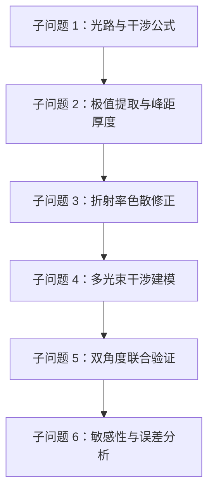

# 问题拆解

## AI 深挖记录 - 2026-05-03

## 总览

题目可以拆成 6 个相互连接的子问题。它们不是并列堆放，而是一条从“物理公式”到“可靠结论”的链。

## 子问题 1：单次反射下的厚度公式

### 要解决什么

建立问题一所需的基本数学模型：在只考虑外延层表面反射和衬底界面一次反射时，厚度如何与波数、折射率、入射角和干涉级次相关。

### 输入

- 入射角 `theta0`
- 外延层折射率 `n`
- 极值对应波数 `nu`
- 干涉级次或相邻极值间距

### 输出

- 单次反射/双光束近似下的厚度公式
- 峰距法 baseline

### 可能模型

- 双光束干涉模型
- 相邻极值峰距模型

### 难点

- 半波损失如何处理。
- 波数单位 $cm^{-1}$ 与厚度单位 $\mu m$ 的转换。
- 折射率是否可视为常数。

### 与其他子问题连接

这是所有后续模型的 baseline。FOD、色散修正和 TMM 都要能退化或对照到这个基础公式。

## 子问题 2：极值提取与峰距厚度估计

### 要解决什么

从反射率-波数数据中提取峰谷，计算每个峰峰/谷谷间隔对应的厚度分布。

### 输入

- 附件 1-4 的波数和反射率数据
- 平滑窗口
- 最小峰距
- 波数区间

### 输出

- 峰谷位置表
- 峰距厚度分布
- 每个附件的厚度均值和标准差

### 可能模型

- 标准峰距法
- FOD 多极值拟合法

### 难点

- 极值提取不是唯一的。
- 低波数区可能不适合直接提峰。
- SiC 与 Si 的谱线特征不同。

### 与其他子问题连接

给 FOD 拟合和 TMM 全谱拟合提供初值，也用于发现旧论文结果是否可疑。

## 子问题 3：折射率色散修正

### 要解决什么

处理题目明确指出的“折射率随波长、载流子浓度变化”的问题。

### 输入

- 波数 `nu`
- 折射率模型 $n(\nu), k(\nu)$
- Larruquert SiC `n,k` 数据或其它文献参数

### 输出

- 色散折射率插值函数
- 色散修正后的厚度估计
- 折射率不确定性对厚度的影响

### 可能模型

- 常数折射率 baseline
- $n(\nu)$ 插值模型
- Drude-Lorentz / MDF 介电函数模型

### 难点

- 外部 `n,k` 数据可能与题目样品不匹配。
- 题目没有给掺杂浓度。
- 复折射率中的 `k` 对峰距公式和全谱模型的作用不同。

### 与其他子问题连接

色散修正是从简单峰距法走向物理可信模型的关键中间层，也为 TMM 提供折射率输入。

## 子问题 4：多光束干涉建模

### 要解决什么

回答问题三：多次反射透射是否会影响厚度计算，如何消除或修正其影响。

### 输入

- 反射率-波数全谱数据
- 外延层厚度初值
- 空气/外延层/衬底折射率
- 入射角
- 偏振设定

### 输出

- 多光束反射率模型
- 全谱拟合厚度
- 残差曲线
- 修正前后厚度对比

### 可能模型

- Airy 公式
- Transfer Matrix Method (TMM)

### 难点

- 参数可能过多，存在多解。
- 衬底、吸收、偏振、相干性处理要明确。
- 全谱拟合好不等于厚度唯一。

### 与其他子问题连接

TMM 应以后续模型出现，而不是一开始就直接上。它需要峰距/FOD 提供合理初值，并用双角度约束减少多解。

## 子问题 5：双角度一致性验证

### 要解决什么

利用题目中“同一晶圆片两个入射角”的结构，检验模型是否稳定。

### 输入

- 附件 1 vs 2
- 附件 3 vs 4
- 各模型分别给出的厚度

### 输出

- 单角度厚度估计
- 双角度联合厚度估计
- 角度差异指标

### 可能模型

- 单独拟合后比较
- 共享厚度 `d` 的联合最小二乘拟合

### 难点

- 两个角度反射率幅度可能不同。
- 需要允许基线/尺度不同，但厚度相同。

### 与其他子问题连接

这是本题最重要的可靠性证据之一。没有外部真值时，角度一致性是替代验证手段。

## 子问题 6：敏感性与误差分析

### 要解决什么

说明厚度结果是否依赖某个任意选择，给出模型局限和可信区间。

### 输入

- 峰谷提取参数
- 波段选择
- 折射率扰动
- 反射率噪声扰动
- 不同模型结果

### 输出

- 敏感性表
- Bootstrap / Monte Carlo 厚度分布
- 误差来源分析
- 模型优缺点

### 可能模型

- 参数扫描
- Bootstrap
- Monte Carlo 加噪声
- 模型间对比

### 难点

- 不要把模拟扰动说成真实误差。
- 没有外部真值时，不能过度宣称准确性。

### 与其他子问题连接

这是结果分析和模型评价章节的核心。它决定论文能否从“算出一个数”变成“说明这个数为什么可信”。

