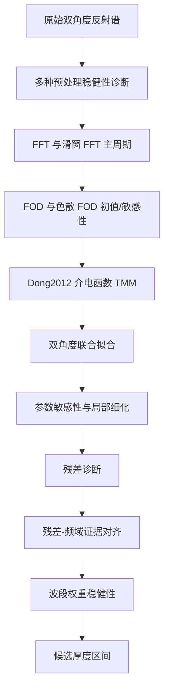

# 基于数据稳健性诊断与介电函数约束 TMM 的碳化硅外延层厚度反演

> 本稿是当前阶段的“收束稿”。它不是最终提交论文，而是把已经验证过的数据处理、物理建模、频域证据、残差诊断、波段权重稳健性和未闭合风险组织成一条可以继续学习和讨论的主线。文中不编造实验、不伪造参考文献；所有数值均来自项目内可复现实验输出。

## 摘要

红外反射谱中的干涉条纹为外延层厚度反演提供了重要信息，但在碳化硅材料中，厚度估计会受到折射率色散、吸收、多光束干涉、载流子相关介电响应、入射角差异和数据预处理口径的共同影响。若只使用相邻峰距公式，厚度结果容易对折射率假设、峰谷识别和波段选择产生显著依赖。为提高结果的可解释性与可追溯性，本文建立了一条由数据处理诊断、频域主周期检查、峰谷级次差法、色散修正、介电函数约束 TMM、残差诊断和波段权重稳健性构成的递进式建模链。

首先，本文对附件 1、附件 2 的 SiC 双角度反射谱进行单位统一、波数排序、等间隔重采样和多种预处理稳健性检查。去均值、移动平均去趋势、多项式去趋势、滚动中位数/分位数基线和一阶差分均给出相同的全波段主周期

$$
\Delta\nu=250\ \mathrm{cm^{-1}},
$$

说明条纹周期是数据中稳定存在的信息，而不是某一种预处理偶然制造的结果。滑窗 FFT 进一步显示局部主周期位于

$$
\Delta\nu\in[244.537,256.000]\ \mathrm{cm^{-1}},
$$

对应常数 $n=2.60$ 口径下的频域厚度初值为

$$
d_{\mathrm{FFT}}\in[7.529,7.882]\ \mu m.
$$

这说明数据中确实存在稳定厚度尺度，但频域厚度换算仍强烈依赖 $n_{\mathrm{eff}}$，不能单独作为最终厚度结论。

在物理模型方面，常数折射率 FOD 和 Larruquert 色散 FOD 分别暴露了峰谷法的初值价值与折射率敏感性。随后，本文基于 Dong2012 的 $4H$-SiC 介电函数构建 Airy/TMM 全谱模型，用双入射角联合 RMSE、材料参数敏感性、波段敏感性、局部坐标细化和 $\nu_p$ 物理边界检查候选厚度。当前最强候选区间为

$$
d\approx7.4\text{--}7.6\ \mu m.
$$

在受 $\nu_p$ 边界约束的局部细化中，代表点为

$$
d^\ast=7.465\ \mu m,\qquad
\mathrm{RMSE}_{\mathrm{joint}}=0.00171152.
$$

进一步的残差-频域证据对齐显示，高残差且周期稳定的波段数为 $1$，高残差且频域证据偏弱或周期不稳的波段数为 $3$，说明并非所有残差问题都应归因于 TMM 物理模型缺项。固定当前受约束 Dong/TMM 参数，只改变波段权重时，四种权重口径下最佳厚度位于

$$
d^\ast\in[7.465,7.485]\ \mu m,
$$

相对全波段等权口径的最大位移仅为

$$
0.020\ \mu m.
$$

因此，本文认为 $d\approx7.4\text{--}7.6\ \mu m$ 已经具备较强候选可信度，但由于 $\gamma$、$\Gamma_L,\Gamma_T$ 的物理边界尚未完全闭合，且 $15^\circ$ 残差仍存在明显连续结构，暂不将 $7.465\ \mu m$ 写成最终确定厚度。

关键词：碳化硅外延层；红外反射谱；数据预处理；FFT；转移矩阵法；介电函数；残差诊断；稳健性分析

## 1 问题重述与研究目标

本题要求根据外延层红外反射谱确定外延层厚度，并讨论多光束干涉对测厚结果的影响。对 SiC 样品，附件 1 与附件 2 分别给出同一块晶圆片在 $10^\circ$ 与 $15^\circ$ 入射角下的反射率谱。数据形式可记为

$$
\mathcal D_{\theta}
=
\{(\nu_i,R_{\mathrm{obs},\theta}(\nu_i))\}_{i=1}^{N_\theta},
\qquad
\theta\in\{10^\circ,15^\circ\}.
$$

其中 $\nu_i$ 是波数，单位为 $\mathrm{cm^{-1}}$，$R_{\mathrm{obs}}$ 是实验反射率。目标是从反射率曲线中恢复外延层厚度 $d$。

本问题的难点不在于写出一个峰距公式，而在于判断这个公式或模型是否真的被数据支持。红外干涉条纹包含厚度尺度，但条纹位置、振幅和相位同时受到折射率、消光系数、入射角、材料介电函数、外延层与衬底光学差异以及仪器基线的影响。因此，本文把研究目标分成三个层级：

第一，确认数据中是否存在稳定的厚度相关条纹周期。若主周期本身不稳定，则任何复杂物理模型都可能只是拟合噪声或局部异常。

第二，建立能够解释多光束干涉和材料色散的物理反演模型。若只用常数折射率峰距法，则无法处理 $n(\nu)$、$k(\nu)$ 和完整反射线型。

第三，检查候选厚度对材料参数、波段选择、残差结构和预处理口径是否稳健。若候选厚度只在某个参数组合或某个波段出现，就不能作为可信结论。

## 2 数据处理：数据中到底有什么信息

### 2.1 单位统一与网格处理

波数和真空波长满足

$$
\lambda_0=\frac{10000}{\nu},
$$

其中 $\lambda_0$ 的单位是 $\mu m$，$\nu$ 的单位是 $\mathrm{cm^{-1}}$。这个 $10000$ 因子必须保留，否则厚度公式会出现数量级错误。反射率若以百分数给出，则统一转换为

$$
R=\frac{R_{\%}}{100}.
$$

FFT 需要等间隔波数网格，因此对排序后的原始数据做线性插值：

$$
R_{\mathrm{grid}}(\nu_j)
=
\mathrm{interp}\left(\nu_j;\nu_{\mathrm{raw}},R_{\mathrm{raw}}\right).
$$

这一步只生成派生数据，不修改原始附件。

### 2.2 预处理不是装饰，而是证据审查

本项目中的数据处理不是为了“把曲线处理成想要的厚度”，而是为了回答：

$$
\text{厚度相关条纹是否是稳定的数据事实？}
$$

本文比较了六类预处理方法：

| 方法 | 数学形式 | 主要作用 | 主要风险 |
| --- | --- | --- | --- |
| [[去均值中心化]] | $R^{(c)}(\nu)=R(\nu)-\bar R$ | 去除常数偏置，保留原始形状 | 不能去除慢变背景 |
| [[移动平均去趋势]] | $R-R_{\mathrm{MA}}$ | 去除慢变背景，突出条纹 | 窗口过小会削弱真实条纹 |
| [[多项式去趋势]] | $R-\sum_{k=0}^{p}a_kx^k$ | 用低阶函数估计背景 | 阶数过高会追随条纹 |
| [[滚动中位数基线]] | $R-\mathrm{median}_{\mathcal W}(R)$ | 对异常点更稳健 | 可能产生局部平台效应 |
| [[滚动分位数基线]] | $R-Q_q(R)$ | 检查上下包络偏置 | 分位数选择具有主观性 |
| [[一阶差分预处理]] | $\Delta R_i=R_i-R_{i-1}$ | 强化变化率和周期 | 放大噪声，不能用于 TMM 反射率拟合 |

全波段预处理诊断显示，所有测试预处理都给出相同主周期：

$$
\Delta\nu=250\ \mathrm{cm^{-1}}.
$$

在常数 $n=2.60$ 口径下，双角度频域厚度初值约为

$$
d_{\mathrm{FFT}}\approx7.71\text{--}7.73\ \mu m.
$$

这说明主周期不是某一种预处理方法制造出来的。差异主要体现在峰值显著性、峰谷数量和局部曲线形态上。

### 2.3 滑窗 FFT 与局部条纹稳定性

全波段 FFT 可能掩盖局部波段差异，因此进一步使用滑窗 FFT。窗口宽度和步长为

$$
W=1200\ \mathrm{cm^{-1}},
\qquad
S=250\ \mathrm{cm^{-1}}.
$$

滑窗结果显示：

$$
\Delta\nu\in[244.537,256.000]\ \mathrm{cm^{-1}},
$$

对应常数 $n=2.60$ 口径下：

$$
d_{\mathrm{FFT}}\in[7.529,7.882]\ \mu m.
$$

因此，数据处理部分的核心结论是：

$$
\boxed{\text{SiC 双角度数据中存在稳定条纹尺度。}}
$$

但频域初值仍不能直接成为最终厚度，因为

$$
d_{\mathrm{FFT}}
=
\frac{10000 f}
{2\sqrt{n_{\mathrm{eff}}^2-\sin^2\theta}},
$$

显然依赖 $n_{\mathrm{eff}}$。数据处理证明条纹尺度稳定，物理模型负责解释这个尺度对应的真实厚度。

## 3 模型假设与符号

本文采用以下必要假设。第一，外延层与衬底界面近似平行，测量区域内可由单一厚度 $d$ 表示。第二，附件 1 与附件 2 来自同一块 SiC 晶圆片，因此 $10^\circ$ 与 $15^\circ$ 反演厚度应一致。第三，外延层与衬底之间存在可观测的光学差异，使反射谱对厚度具有可识别性。

本文也采用若干简化假设。FOD 基线模型中先使用常数折射率；色散 FOD 使用本地 Larruquert 数据作为可复现光学常数输入；Dong/TMM 模型使用 Dong2012 介电函数参数作为物理约束，但该参数来自文献样品，不是本题样品的独立标定结果；全谱拟合允许实验反射率与模型反射率之间有仿射校准：

$$
R_{\mathrm{obs}}(\nu)
\approx
aR_{\mathrm{model}}(\nu;d)+b.
$$

该校准可以吸收仪器尺度和基线差异，但也会削弱绝对反射率幅值约束。

主要符号如下。

| 符号 | 含义 | 单位或说明 |
| --- | --- | --- |
| $\nu$ | 波数 | $\mathrm{cm^{-1}}$ |
| $\lambda_0$ | 真空波长 | $\mu m$ |
| $d$ | 外延层厚度 | $\mu m$ |
| $\theta_0$ | 空气中入射角 | $^\circ$ |
| $\theta_1$ | 外延层内折射角 | Snell 定律给出 |
| $n(\nu)$ | 折射率实部 | 色散函数 |
| $k(\nu)$ | 消光系数 | 色散函数 |
| $\tilde n(\nu)$ | 复折射率 | $\tilde n=n+ik$ |
| $R_{\mathrm{obs}}$ | 实验反射率 | 附件数据 |
| $R_{\mathrm{model}}$ | 模型反射率 | TMM 计算 |
| $\Delta\nu$ | 条纹周期 | $\mathrm{cm^{-1}}$ |
| $\nu_p$ | 等离子体频率参数 | Dong 介电函数参数 |
| $\gamma$ | Drude 阻尼 | Dong 介电函数参数 |
| $\Gamma_L,\Gamma_T$ | 声子阻尼 | Dong 介电函数参数 |
| $\mathrm{RMSE}$ | 均方根误差 | 反射率尺度 |

## 4 基线模型：峰距法与 FOD

### 4.1 常数折射率峰距公式

在常数折射率近似下，同类相邻极值之间的波数差 $\Delta\nu$ 与厚度满足

$$
d
\approx
\frac{10000}
{2n\cos\theta_1\Delta\nu}.
$$

其中

$$
\cos\theta_1
=
\sqrt{1-\left(\frac{\sin\theta_0}{n}\right)^2}.
$$

需要强调的是，峰-峰或谷-谷相邻极值对应一级次差，峰-谷混合序列才对应半级次差。若混淆这两种级次口径，厚度会出现近似一倍的系统误差。

### 4.2 FOD 多极值拟合

FOD 方法不只使用一个相邻峰距，而是把多个同类极值纳入线性级次差关系。设 $\nu_{\mathrm{ref}}$ 是参考极值，$\nu_j$ 是第 $j$ 个同类极值，则

$$
\Delta p_j
\approx
\frac{2d}{10000}n\cos\theta_1
\left(\nu_{\mathrm{ref}}-\nu_j\right).
$$

对应的最小二乘问题为

$$
\min_d
\sum_j
\left[
\Delta p_j
-
\frac{2d}{10000}n\cos\theta_1
\left(\nu_{\mathrm{ref}}-\nu_j\right)
\right]^2.
$$

当前常数折射率 FOD 结果显示：

| 数据 | 厚度估计 |
| --- | --- |
| SiC $10^\circ$ | $7.191\pm0.148\ \mu m$ |
| SiC $15^\circ$ | $6.603\pm0.089\ \mu m$ |

该结果给出了合理厚度量级，但双角度一致性不足，不能作为最终结论。

## 5 色散 FOD：折射率模型是主误差源

若折射率随波数变化，则相位因子应写为

$$
g(\nu)
=
n(\nu)\nu\cos\theta_1(\nu),
$$

其中

$$
\cos\theta_1(\nu)
=
\sqrt{
1-\left(
\frac{\sin\theta_0}{n(\nu)}
\right)^2
}.
$$

色散 FOD 关系为

$$
\Delta p_j
\approx
\frac{2d}{10000}
\left[
g(\nu_{\mathrm{ref}})-g(\nu_j)
\right].
$$

使用 Larruquert SiC 光学常数插值后，当前色散 FOD 给出约 $5.3\text{--}5.8\ \mu m$ 的厚度范围，明显低于常数折射率 FOD。本文不把这个结果直接解释为真实厚度更小，而是把它作为折射率敏感性的证据：

$$
\boxed{\text{厚度反演对 }n(\nu)\text{ 的选择非常敏感。}}
$$

因此，最终模型必须进入复折射率和完整反射线型，而不能停留在峰距公式。

## 6 Dong/TMM 全谱模型

### 6.1 Airy/TMM 反射模型

单层外延膜的相位厚度可写为

$$
\delta(\nu;d)
=
\frac{2\pi}{10000}
\tilde n_1(\nu)d\cos\theta_1(\nu)\nu.
$$

Airy 反射振幅为

$$
r(\nu;d)
=
\frac{
r_{01}+r_{12}\exp(2i\delta)
}{
1+r_{01}r_{12}\exp(2i\delta)
}.
$$

反射率为

$$
R_{\mathrm{model}}(\nu;d)
=
|r(\nu;d)|^2.
$$

TMM 是 Airy 模型的矩阵化形式，更适合推广到多层膜和复杂折射率。本文当前使用单层外延层加衬底结构，因此 Airy/TMM 在本项目中承担的是完整多光束干涉正演模型。

### 6.2 Dong2012 介电函数约束

Dong2012 提供了 $4H$-SiC 红外介电函数模型。其基本思想是用声子项和 Drude 载流子项描述复介电响应，再由

$$
\tilde n(\nu)
=
\sqrt{\varepsilon(\nu)}
$$

得到复折射率。当前项目将 Dong2012 表 2 参数作为物理初始约束，并对 $\nu_p$、$\gamma$、$\Gamma_L,\Gamma_T$ 做缩放敏感性分析。

需要明确的是：Dong2012 参数不是本题样品参数。它的作用是提供比人工 $\Delta n$ 更有物理来源的介电函数地基，而不是直接给出最终材料参数。

### 6.3 双角度联合目标函数

对每个角度，模型反射率先做仿射校准：

$$
R_{\mathrm{fit},\theta}(\nu;d)
=
a_\theta R_{\mathrm{model},\theta}(\nu;d)+b_\theta.
$$

单角度误差为

$$
\mathrm{RMSE}_\theta(d)
=
\sqrt{
\frac{1}{m_\theta}
\sum_{i=1}^{m_\theta}
\left[
R_{\mathrm{obs},\theta}(\nu_i)
-
R_{\mathrm{fit},\theta}(\nu_i;d)
\right]^2
}.
$$

联合误差采用双角度平均：

$$
\mathrm{RMSE}_{\mathrm{joint}}(d)
=
\frac{1}{2}
\left[
\mathrm{RMSE}_{10^\circ}(d)
+
\mathrm{RMSE}_{15^\circ}(d)
\right].
$$

该目标函数体现了同一晶圆片双角度厚度应一致的物理约束。

## 7 参数敏感性与局部优化结果

Dong/TMM 模型下，厚度低谷在多个敏感性实验中保持在 $7.4\text{--}7.6\ \mu m$ 附近。当前汇总如下。

| 检查口径 | 厚度低谷或范围 | 作用 |
| --- | --- | --- |
| Dong2012 表 2 TMM | $7.40\text{--}7.46\ \mu m$ | 建立物理正演候选 |
| $\nu_p$ 敏感性 | $7.44\text{--}7.58\ \mu m$ | 检查载流子项影响 |
| $\gamma$ 敏感性 | $7.44\text{--}7.46\ \mu m$ | 检查 Drude 阻尼影响 |
| $\Gamma_L,\Gamma_T$ 敏感性 | $7.40\text{--}7.48\ \mu m$ | 检查声子阻尼影响 |
| 波段敏感性 | $7.38\text{--}7.44\ \mu m$ | 检查拟合区间影响 |
| 分阶段坐标搜索 | $7.46\ \mu m$ | 探索性联合调参 |
| 局部细化 | $7.465\ \mu m$ | 局部优化补充 |
| 有 $\nu_p$ 物理边界局部细化 | $7.465\ \mu m$ | 物理约束补充 |

其中，有 $\nu_p$ 物理边界的局部细化给出：

$$
d^\ast=7.465\ \mu m,
\qquad
\mathrm{RMSE}_{\mathrm{joint}}=0.00171152.
$$

分角度结果为：

| 数据 | 单角度最佳厚度 | RMSE |
| --- | --- | --- |
| SiC $10^\circ$ | $7.490\ \mu m$ | $0.00112873$ |
| SiC $15^\circ$ | $7.430\ \mu m$ | $0.00188375$ |

这说明联合厚度低谷较稳定，但 $15^\circ$ 仍更难拟合。外延层 $\nu_p$ 缩放因子触及上界

$$
s_{\nu_p,\mathrm{epi}}=1.75,
$$

因此不能把当前材料参数写成内部最优材料参数，只能写作候选边界内的边界最优状态。

## 8 残差诊断：为什么还不能说完全完成

残差定义为

$$
r_\theta(\nu)
=
R_{\mathrm{obs},\theta}(\nu)
-
R_{\mathrm{fit},\theta}(\nu).
$$

若残差只是随机噪声，则相邻残差不应高度相关。因此计算一阶自相关：

$$
\rho_1
=
\frac{
\sum_{j=1}^{m-1}(r_j-\bar r)(r_{j+1}-\bar r)
}{
\sum_{j=1}^{m}(r_j-\bar r)^2
}.
$$

当前残差指标为：

| 数据 | RMSE | MAE | 一阶自相关 | 最大同号连续段 |
| --- | --- | --- | --- | --- |
| SiC $10^\circ$ | $0.00131074$ | $0.00094374$ | $0.9726$ | $63$ |
| SiC $15^\circ$ | $0.00211230$ | $0.00168736$ | $0.9834$ | $221$ |

这说明残差不是完全随机噪声，尤其 $15^\circ$ 仍存在明显结构性误差。残差高发波段包括 SiC $15^\circ$ 的 $1500\text{--}2000\ \mathrm{cm^{-1}}$、$2000\text{--}2500\ \mathrm{cm^{-1}}$ 和 $3500\text{--}4000\ \mathrm{cm^{-1}}$，以及 SiC $10^\circ$ 的 $1500\text{--}2000\ \mathrm{cm^{-1}}$。

## 9 残差与频域证据对齐

为判断残差高是数据问题还是模型问题，本文将 $500\ \mathrm{cm^{-1}}$ 残差波段与滑窗 FFT 窗口对齐。若残差波段为 $B=[\nu_a,\nu_b]$，滑窗为 $W_k=[u_k,v_k]$，则重叠长度为

$$
\ell_k
=
\max\left(0,\min(\nu_b,v_k)-\max(\nu_a,u_k)\right).
$$

用重叠长度计算该残差波段附近的主周期统计。诊断结果显示：

$$
\text{高残差且周期稳定波段数}=1,
$$

$$
\text{高残差且频域证据偏弱或周期不稳波段数}=3.
$$

这说明并非所有高残差都应归因于 TMM 物理模型缺项。部分波段的频域证据本身偏弱，更应该通过波段权重、吸收区检查或数据预处理审查处理。对 SiC $10^\circ$ 的 $1500\text{--}2000\ \mathrm{cm^{-1}}$，残差高但周期相对稳定，因此更可能暴露材料模型、背景校准、偏振或各向异性不足。

## 10 波段权重稳健性分析

为了检查候选厚度是否由局部异常波段主导，本文固定当前受约束 Dong/TMM 材料参数，只改变不同波段在目标函数中的权重。加权目标函数为

$$
J_w(d)
=
\sqrt{
\frac{
\sum_i w_i
\left[
R_{\mathrm{obs}}(\nu_i)
-
R_{\mathrm{fit}}(\nu_i;d)
\right]^2
}{
\sum_i w_i
}
}.
$$

比较四种口径：

| 权重口径 | $d^\ast$ | joint weighted RMSE | 有效点数 | 说明 |
| --- | --- | --- | --- | --- |
| `all_equal` | $7.465\ \mu m$ | $0.00171152$ | $1730$ | 全波段等权 |
| `frequency_screened` | $7.485\ \mu m$ | $0.00117362$ | $692$ | 只保留频域证据强的波段 |
| `frequency_downweighted` | $7.475\ \mu m$ | $0.00160333$ | $1730$ | 频域证据弱波段降权 |
| `continuous_frequency_weight` | $7.470\ \mu m$ | $0.00168194$ | $1730$ | 连续频域权重 |

因此，

$$
d^\ast\in[7.465,7.485]\ \mu m,
$$

最大厚度位移为

$$
\max|\Delta d|=0.020\ \mu m.
$$

这是一条重要稳健性证据。它说明当前候选厚度不是由单一异常波段支撑的。不过 `frequency_screened` 只保留 $692$ 个有效点，因此它不能替代全波段主模型，只能作为旁证。

## 11 综合结论

当前证据链可以概括为：

基于当前证据，本文最谨慎的结论是：

$$
\boxed{
d_{\mathrm{candidate}}
\approx
7.4\text{--}7.6\ \mu m
}.
$$

在固定当前受约束 Dong/TMM 参数、局部细化和波段权重稳健性检查条件下，代表厚度集中在

$$
7.465\text{--}7.485\ \mu m.
$$

但本文仍不把 $7.465\ \mu m$ 写成最终确定厚度。原因是：

1. $\gamma$ 与 $\Gamma_L,\Gamma_T$ 的物理/经验边界还不如 $\nu_p$ 完整；
2. 部分材料参数触及边界，说明材料参数识别尚未闭合；
3. $15^\circ$ 残差自相关很高，仍有结构性误差；
4. Dong2012 参数属于文献样品，存在参数迁移风险；
5. 当前 bootstrap 固定材料参数，没有覆盖完整材料参数不确定性。

## 12 论文中应如何表达

推荐写法：

> 多种数据预处理和频域诊断均显示 SiC 双角度反射谱存在稳定主周期，说明题目数据中包含稳定厚度尺度。基于 Dong2012 介电函数约束 TMM 的双角度联合拟合、参数敏感性、波段敏感性和波段权重稳健性检查均未将厚度低谷推出 $7.4\text{--}7.6\ \mu m$。因此，本文将该范围作为当前最强候选厚度区间。

不推荐写法：

> 本文精确求得碳化硅外延层厚度为 $7.465\ \mu m$。

因为该写法忽略了材料参数边界、残差结构和参数迁移风险。

## 13 当前是否已经“差不多完成”

从建模角度看，主线已经基本成立：

$$
\text{数据中有稳定条纹}
\rightarrow
\text{TMM 解释条纹}
\rightarrow
\text{敏感性与权重检查未推翻候选区间}.
$$

因此，可以说“主模型已经具备可写成论文的基础”。但从最终严谨性看，还没有完全闭合。最重要的剩余工作不是继续堆模型，而是做收口：

1. 把 $\gamma$、$\Gamma_L,\Gamma_T$ 的物理/经验边界写清；
2. 解释 $15^\circ$ 残差连续结构；
3. 把当前图表、表格和模型证据组织成正式论文；
4. 决定是否需要进行更高成本的“波段权重 + 材料参数联合优化”。

若进入第 4 项，任务规模会明显增加，应按项目规则先评估是否需要接入学校服务器。

## 14 参考文献状态

本稿不伪造正式参考文献。当前已使用或应核验的资料状态如下：

| 资料 | 当前用途 | 状态 |
| --- | --- | --- |
| Dong2012 $4H$-SiC FTIR 论文 | 介电函数与 TMM 物理模型来源 | 已下载并转化，参数迁移风险需写明 |
| Li2010 FOD 方法资料 | 峰谷级次差法思想来源 | 已有精读笔记，正式格式待核验 |
| Larruquert SiC 光学常数 | 色散 FOD 与 $n(\nu),k(\nu)$ 插值 | 已用于本地实验，材料适用性待核验 |
| Sun et al. 2023 | 近年 FTIR epi-wafer 频域方法线索 | 需要继续精读，不能未读全文引用具体结论 |
| Dutta et al. 2022 | 全局优化和反问题非唯一性线索 | 需要继续精读 |
| Chahal et al. 2024 | n-doped $4H$-SiC 红外介电参数边界线索 | 需要继续精读 |

## 附录 A：核心代码与输出

| 模块 | 脚本 | 关键输出 |
| --- | --- | --- |
| 基础峰谷/FOD | `Code/spectral_pipeline.py` | `Experiments/outputs/` 中 FOD 结果 |
| 色散 FOD | `Code/dispersion_analysis.py` | `dispersion_fod_summary.md` |
| Dong/TMM 敏感性 | `Code/dong2012_tmm_*.py` | 参数敏感性与局部细化结果 |
| 残差诊断 | `Code/residual_diagnostics.py` | `residual_diagnostics_summary.md` |
| FFT 主周期 | `Code/fft_frequency_seed.py` | `fft_frequency_seed_summary.md` |
| 预处理稳健性 | `Code/data_processing_diagnostics.py` | `data_processing_diagnostics_summary.md` |
| 滑窗 FFT | `Code/sliding_fft_diagnostics.py` | `sliding_fft_diagnostics_summary.md` |
| 残差-频域对齐 | `Code/residual_fft_alignment.py` | `residual_fft_alignment_summary.md` |
| 波段权重稳健性 | `Code/band_weighted_tmm_profile.py` | `band_weighted_tmm_profile_summary.md` |

## 附录 B：给后续学习的阅读顺序

建议用户后续按以下顺序学习本项目：

1. 先读 [[去均值中心化]]、[[移动平均去趋势]]、[[多项式去趋势]]、[[滚动中位数基线]]、[[滚动分位数基线]]、[[一阶差分预处理]]，理解数据处理不是修饰，而是证据审查。
2. 再读 [[FFT频域厚度初值]] 与 [[滑窗FFT与波段筛选]]，理解条纹周期和厚度初值的关系。
3. 再读 [[峰谷级次差法FOD]] 与 [[色散修正FOD]]，理解为什么简单峰距公式不够。
4. 再读 [[TMM转移矩阵法]] 与 [[Lorentz-Drude介电函数模型]]，理解主物理模型。
5. 再读 [[残差诊断]]、[[残差与频域证据对齐]]、[[波段权重稳健性分析]]，理解为什么一个模型不能只看 RMSE 最小。
6. 最后读本文正文，逐节把“数据事实、物理模型、稳健性证据、限制条件”连成一条线。
